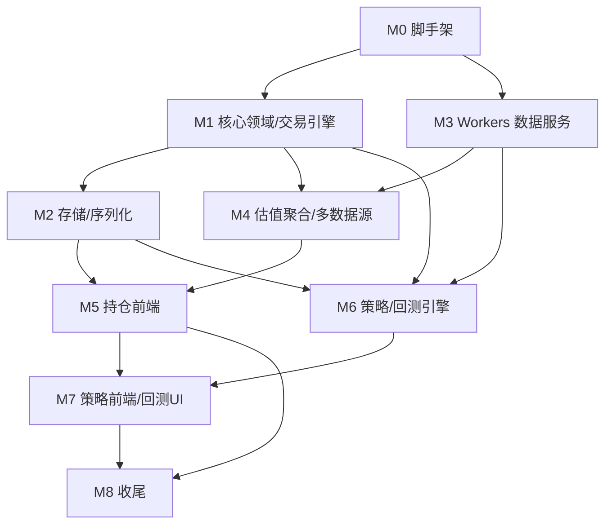

# 基金模拟投资助手 — 任务拆解

> 文档版本：v1.0
> 阶段：任务拆解
> 依赖：《需求分析.md》(R1–R13)、《技术方案.md》
> 说明：任务按依赖顺序编排，分阶段（里程碑）推进；每个任务标注关联需求与所在包。不含工作量估算。

---

## 0. 里程碑总览

| 里程碑 | 名称 | 目标 | 关联需求 |
|--------|------|------|---------|
| M0 | 工程脚手架 | monorepo、构建、部署链路跑通 | R13 |
| M1 | 核心领域与交易引擎 | 模型 + 场外交易规则 + 持仓计算 | R1, R12 |
| M2 | 存储与序列化 | StorageAdapter + Base64 导入导出 | R3, R10, R11 |
| M3 | 数据服务(Workers) | 估值/历史/持仓/行情/日历代理 | R4, R13 |
| M4 | 估值聚合与多数据源 | Provider 抽象 + 三数据源 | R4, R5, R6 |
| M5 | 持仓前端 | 持仓/集合管理/估值 UI | R1, R2, R4, R5 |
| M6 | 策略与回测 | 策略模板 + 策略集 + 回测引擎 | R7, R8, R9 |
| M7 | 策略前端与回测 UI | 策略编辑/回测可视化/导入导出 | R7, R8, R9, R10 |
| M8 | 收尾 | 测试、合规文案、部署、文档 | 全部 |

---

## M0 工程脚手架（R13）✅ 已完成

- [x] **T0.1** 初始化 pnpm monorepo：根 `package.json`、`pnpm-workspace.yaml`、`tsconfig.base.json`、ESLint/Prettier。
- [x] **T0.2** 创建 `packages/core` 包骨架（tsconfig、vitest、`src/index.ts` 导出占位）。
- [x] **T0.3** 创建 `packages/web`：Vite + React + TS + 路由 + Zustand + AntD + ECharts，基础布局与空白页面路由。
- [x] **T0.4** 创建 `packages/workers`：Hono + wrangler 配置，健康检查路由 `/api/ping`，本地 `wrangler dev` 跑通。
- [x] **T0.5** 打通联调：web 配置 Workers API base（Vite 代理），前端调用 `/api/ping` 成功（已浏览器验证连接状态为绿色）。
- [x] **T0.6** 部署链路：Pages 构建配置 + Workers `wrangler deploy` 流程已在 README 文档化。

> 出口标准：三包可独立构建；本地 web ↔ workers 联调成功。✅

---

## M1 核心领域与交易引擎（R1, R12）— `@fund/core` ✅ 已完成

- [x] **T1.1** 定义领域类型：`FundInfo/NavPoint/RedeemFeeTier`、`Portfolio/Position/ShareLot/Order/Transaction`、枚举与 `schemaVersion` 常量。（含 `PendingCash`/`PendingShares` 在途资金与份额）
- [x] **T1.2** 金额/份额精度工具：统一四舍五入（金额 2 位、份额 4 位）+ 安全数值运算 + `generateId`。
- [x] **T1.3** `TradingCalendar`：交易日判定、下一个/上一个交易日、T+N 计算、区间交易日；支持注入节假日/补班，离线退化（周末规则）。
- [x] **T1.4** 确认日计算器：实现 15:00 分界 + 节假日顺延（决策1）。
- [x] **T1.5** 费用计算：申购费(外扣默认/内扣)、赎回费(FIFO 按 `lots` 持有天数分档)、转换费。
- [x] **T1.6** 订单状态机与结算：`下单→PENDING→(净值可得)结算→CONFIRMED`，撤单解冻；份额 T+1 可卖、资金 T+N 到账；幂等结算。
- [x] **T1.7** 交易操作 API：`submitBuy/submitSell/submitConvert/cancelOrder`（生成 Order，遵循确认日与费率，下单即冻结现金/份额）。
- [x] **T1.8** 持仓与收益计算：市值、成本、收益、收益率、当日盈亏、总资产（`snapshotPortfolio`）。
- [x] **T1.9** 单测：47 个用例全绿，覆盖确认日（各时点/节假日）、费率分档、份额计算、买卖转结算、T+1/T+N、持仓收益。**（核心正确性）**

> 出口标准：给定操作序列与净值数据，持仓/现金/流水计算结果正确且有测试覆盖。✅

---

## M2 存储与序列化（R3, R10, R11）— `@fund/core` + `packages/web/adapters` ✅ 已完成

- [x] **T2.1** `StorageAdapter` 接口（core/storage）+ `MemoryStorageAdapter` + 存储键约定 + 三个 Repository（Portfolio/StrategySet/Settings）。
- [x] **T2.2** `LocalStorageAdapter`（web）实现；容量预估（`estimateUsage`/`willExceedLimit`）与超限预警工具。
- [x] **T2.3** 序列化基础：JSON ↔ bytes ↔ Base64（平台无关 btoa/Buffer 双实现）+ pako deflate 压缩；magic header(`FUNDPF1:`/`FUNDSS1:`)。
- [x] **T2.4** `export/importPortfolio`、`export/importStrategySet`：严格 schema 校验、`ImportError` 错误码、重名生成副本、新 id 重分配、`detectImportType`。
- [x] **T2.5** 版本迁移框架：`migratePortfolio/migrateStrategySet` 按 schemaVersion 升级，高版本拒绝。
- [x] **T2.6** 单测：往返幂等、非法数据拒绝（BAD_HEADER/DECODE_FAILED/VALIDATION_FAILED）、重名副本、迁移、仓储 CRUD、容量估算。**（核心正确性，累计 72 用例全绿）**

> 出口标准：持仓集合/策略集可无损 Base64 导出再导入；脏数据被安全拒绝。✅

> 附：M2 同时引入了 `domain/strategy.ts`（策略与策略集类型）与 `strategy/factory.ts`，供序列化与后续 M6 复用。

---

## M3 数据服务 Workers（R4, R13）— `packages/workers` ✅ 已完成

- [x] **T3.1** 路由与中间件骨架：CORS（限定 Pages 域）、错误处理、统一响应/错误码（`ok`/`fail`/`ErrorCodes`）、令牌桶限流、标准化 DTO 定义。
- [x] **T3.2** 缓存层封装：`cached()`（KV + 进程内 Map 双实现）+ 差异化 TTL 预设；带超时的上游 fetch 封装（`UpstreamError`）。
- [x] **T3.3** `/api/calendar`：内置 2023–2026 A股节假日/补班静态数据 + 长缓存 + 周末退化。
- [x] **T3.4** `/api/fund-info`：基金基础信息（搜索接口 + 估值接口退化）。
- [x] **T3.5** `/api/history`：历史净值代理（?code&start&end&source）+ 分页拉取 + 缓存 + 升序标准化。
- [x] **T3.6** providers：天天基金估值适配（JSONP 解析 → 标准 `ValuationDTO`）。
- [x] **T3.7** providers：蛋卷估值适配（derived 接口，最近确认净值，用于对比/容灾）。
- [x] **T3.8** `/api/valuation`：批量（上限 50）+ `source` 切换 + 单基金失败自动降级到备用源。
- [x] **T3.9** providers 解析快照测试（真实样例响应）：eastmoney/danjuan/calendar/限流，共 12 用例全绿。

> 出口标准：估值/历史/日历/基础信息接口返回标准化 DTO，带缓存与降级。✅
> 已用 `wrangler dev` 实测：valuation（天天/蛋卷双源）、history、fund-info、calendar、错误处理均返回正确数据。

> 备注：蛋卷盘中实时估值接口需登录，公开可用的是 derived（最近确认净值）；天天基金提供真正的盘中估值。两源仍可对比。自建估值（真正盘中加权）在 M4 实现。

---

## M4 估值聚合与多数据源（R4, R5, R6）✅ 已完成

### Workers 侧（自建估值）
- [x] **T4.1** `/api/holdings`：天天基金公开持仓抓取（HTML 解析重仓股 + 权重 + 报告期，市场前缀映射 symbol）+ 天级缓存。
- [x] **T4.2** `/api/quote`：腾讯个股实时行情（GBK 解码、批量合并请求规避子请求限制）+ 短缓存。
- [x] **T4.3** `/api/self-nav`：自建估值计算（持仓加权 + 沪深300 补全未覆盖仓位 + confidence 覆盖率，决策5），内部聚合 holdings+quote+baseNav。
- [x] **T4.4** 自建估值算法单测（覆盖率/补全/行情缺失/无基准边界，4 用例）。

### Core 侧（聚合）
- [x] **T4.5** `ValuationProvider` 接口 + `Valuation` 类型 + `VALUATION_SOURCES` 元信息（core 不直接联网）。
- [x] **T4.6** `ValuationAggregator`：注册多源、`fetchFrom` 单源、`fetchCompare` 多源并列对比矩阵（某源失败隔离）。

### Web 侧客户端
- [x] **T4.7** `api/funds.ts` 封装 Workers 各接口；`api/providers.ts` 实现 `ApiValuationProvider` 并构建聚合器。

> 出口标准：同一基金可获取天天/蛋卷/自建三源估值并对比，自建源带覆盖率。✅
> 实测：110011 持仓覆盖率 43.53%，自建估值 +1.07%（confidence 0.4353），GBK 行情解码、沪深300 补全均正确。

> 累计测试：core 77 + workers 25 = 102 用例全绿。

---

## M5 持仓前端（R1, R2, R4, R5）— `packages/web` ✅ 已完成

- [x] **T5.1** `portfolioStore`（Zustand）：集合 CRUD/切换/重命名，桥接 core 交易引擎（买/卖/转/撤/结算）+ adapter 持久化 + 净值缓存驱动结算。
- [x] **T5.2** `valuationStore`：估值拉取、多源选择、手动刷新；`isTradingTime` 交易时段判定。
- [x] **T5.3** `settingsStore` + 设置页：默认数据源、自动刷新开关/间隔、默认申购费率。
- [x] **T5.4** 集合管理页：增删改名、切换、导入/导出（Base64 文本框 + 复制 + 重名副本提示）。
- [x] **T5.5** 持仓总览页：总资产/总收益/收益率/可用现金/当日盈亏 + 持仓明细表（估值/收益）。
- [x] **T5.6** 操作弹窗 `TradeModal`：买入/卖出/转换表单（持仓下拉、校验、提交）。
- [x] **T5.7** 待确认订单卡片（撤单/结算检查）+ 交易流水卡片；进入页面自动触发结算。
- [x] **T5.8** 估值面板：数据源切换、刷新控制、自建源覆盖率标注；`useAutoRefresh` 交易时段轮询。

> 出口标准：用户可创建多集合、完整买卖转换、看实时估值与收益、导入导出集合。✅
> 浏览器实测：创建"测试组合"(¥10万)→ 买入 000001(¥5万)→ 现金冻结为 ¥5万、生成 PENDING 订单且确认日正确顺延至下一交易日(2026-06-01，因 5-31 为周日)→ localStorage 持久化 → Base64 导出(FUNDPF1: 开头)，控制台 0 错误。

---

## M6 策略与回测引擎（R7, R8, R9）— `@fund/core/strategy` ✅ 已完成

- [x] **T6.1** 策略类型与参数（判别联合）：DCA/THRESHOLD_BUY/TAKE_PROFIT/STOP_LOSS/GRID + `StrategySet/ConflictPolicy`（M2 已建类型，M6 补齐运行时类型 `DayContext/StrategyAction`）。
- [x] **T6.2** 策略求值器 `evaluateStrategy`：5 个模板实现 + 运行时状态（定投周期键、阈值买入冷却、网格层）。
- [x] **T6.3** 冲突归并器 `mergeActions`：先卖后买、同向合并（金额相加/比例上限 1）。
- [x] **T6.4** 回测引擎 `runBacktest`：逐交易日循环（求值→归并→成交→快照），统一申购/赎回费率。
- [x] **T6.5** 回测指标：总收益、年化、最大回撤、买入持有基准对比。
- [x] **T6.6** 单测：5 模板触发、冲突归并、指标计算、回测端到端（定投/止盈/费率/回撤/边界），共 31 用例。**（核心正确性）**

> 出口标准：给定策略集 + 历史净值 + 区间，输出可验证的回测指标与流水。✅
> 累计测试：core 111 + workers 25 = 136 用例全绿。

---

## M7 策略前端与回测 UI（R7, R8, R9, R10）— `packages/web` ✅ 已完成

- [x] **T7.1** `strategyStore`：策略/策略集 CRUD + adapter 持久化。
- [x] **T7.2** `StrategyModal` 策略编辑：模板选择 + 按模板动态参数表单（5 类模板，百分比字段自动换算）。
- [x] **T7.3** 策略集页：组合策略、启用开关、导入/导出（Base64 FUNDSS1，复用 M2）。
- [x] **T7.4** 回测页表单：选策略集/区间/初始资金/基准标的。
- [x] **T7.5** 回测执行：独立 Web Worker 跑 core `runBacktest`；历史数据经 api 拉取。
- [x] **T7.6** 回测结果可视化（ECharts）：净值曲线 vs 基准、指标卡片、操作流水表、超额收益提示。

> 出口标准：用户可定义策略集、导入导出、选区间回测并看到可视化结果。✅
> 浏览器实测：创建策略集"定投回测"→ 加 DCA 策略（000001 每月¥2000）→ 回测 2024 全年 → 12 笔定投、期末 ¥101,232.94(+1.23%)、最大回撤 2.17%、基准对比 -3.24%(超额+4.5%)，净值曲线/流水正常。

> **集成期修复**：发现并修复天天基金历史净值接口实际每页上限 20 条（忽略更大 pageSize）的问题——改用 TotalCount 驱动分页，使全区间历史数据完整返回（2024 全年 243 个交易日）。此前回测仅 1 笔交易是该 API 缺陷所致，回测引擎本身正确。

---

## M8 收尾（全部）✅ 已完成

- [x] **T8.1** 合规文案：全局横幅 + 回测结果页风险提示（历史不代表未来、统一费率近似、不构成投资建议）。
- [x] **T8.2** 错误与降级体验：估值失败 Alert 提示（可切源重试）、数据源失败自动降级（M3）、空状态/加载态。
- [x] **T8.3** 核心库测试补全：新增 portfolio/strategy 工厂测试，累计 core 117 用例。
- [x] **T8.4** Workers 限流/缓存：令牌桶限流（M3）+ 差异化 TTL；修复历史接口分页缺陷（M7）。
- [x] **T8.5** 部署：Pages 构建/输出/环境变量、Workers CORS 白名单与 KV 绑定说明已文档化；前端按 react/antd 分包 + ECharts 懒加载，初始包显著减小。
- [x] **T8.6** 文档：README 补充部署步骤、数据来源说明、测试命令。
- [x] **T8.7** 小程序演进预留：README 说明 `WxStorageAdapter`、网络复用、UI 重写、回测主线程方案。

> 出口标准：全部测试通过、构建无警告、部署与演进路径清晰。✅
> 最终：core 117 + workers 25 = 142 用例全绿；core/web/workers 全部构建通过。

---

## 任务依赖图

**并行建议**：M0 完成后，M1（core）与 M3（workers）可并行；M2 依赖 M1；M4 依赖 M1+M3。

---

## 需求 → 任务覆盖矩阵

| 需求 | 描述 | 覆盖任务 |
|------|------|---------|
| R1 | 模拟持仓操作 | T1.1–T1.9, T5.5–T5.7 |
| R2 | 多持仓集合 | T2.1, T5.1, T5.4 |
| R3 | 持仓 Base64 导入导出 | T2.3–T2.6, T5.4 |
| R4 | 实时估值查看 | T3.5–T3.8, T4.5–T4.7, T5.2, T5.8 |
| R5 | 多数据源切换对比 | T3.6–T3.8, T4.6, T5.8 |
| R6 | 自建公开持仓估算 | T4.1–T4.4 |
| R7 | 自定义策略 | T6.1–T6.2, T7.1–T7.2 |
| R8 | 策略集 | T6.1, T6.3, T7.3 |
| R9 | 策略回测 | T6.4–T6.6, T7.4–T7.6 |
| R10 | 策略集 Base64 导入导出 | T2.3–T2.6, T7.3 |
| R11 | localStorage 持久化/抽象 | T2.1–T2.2 |
| R12 | 平台无关核心库 | M1/M2/M4(core)/M6 全部, T8.7 |
| R13 | Workers 数据/计算 | M0, M3, M4(workers), T8.4–T8.5 |

---

## 交付后调整记录（Post-Delivery）

> 交付后基于用户反馈的迭代，记录变更点、影响范围与验证方式，保持文档与实现同步。

### ADJ-1 新建集合支持配置现有持仓（R1/R2 增强）
- **背景**：用户希望新建持仓集合时可直接录入已有的基金持仓，而非只能从空仓开始买入。
- **变更**：
  - `@fund/core` `createPortfolio` 新增可选 `positions: InitialPosition[]` 参数（基金代码 / 持有份额 / 持仓成本 / 可选买入日期）；自动生成份额批次 lot（`nav = cost / shares`）并设为可卖。
  - 收益口径：`initialCash`（收益基准）= 输入可用现金 + 现有持仓成本之和，保证"总收益 = 总资产 − 初始总投入"。
  - Web `portfolioStore.create` 透传 positions 并异步预取基金名称；`PortfoliosPage` 新建弹窗加入"现有持仓（可选）"动态表单（Form.List，可增删多条）。
- **测试**：新增 core 工厂用例（成本计入基准、份额可卖、忽略 0 份额项）；浏览器实测 100,000 现金 + 000001(5000份/成本6500) → 基准 106,500、avg nav 1.30 正确。

### ADJ-2 编辑策略未回填自身数据（bug 修复）
- **现象**：策略集中点击"编辑"，弹窗未回填该条策略的已有参数（尤其模板相关的条件字段）。
- **根因**：原 `StrategyModal` 用 `useEffect + setFieldsValue` 配合 `destroyOnHidden`，条件参数字段挂载时机晚于赋值，导致回填丢失。
- **修复**：改为表单级 `initialValues` + `key` 强制重建表单；切换模板类型用 `onValuesChange` 填默认参数；移除与表单级初值冲突的字段级 `initialValue`。
- **测试**：浏览器实测编辑"月定投"→ 名称/标的/类型/周期/执行日/金额全部正确回填。

> 累计测试：core 119 + workers 25 = 144 用例全绿；web typecheck + build 通过。

### ADJ-3 持仓成本单价精度 + 初始持仓收益口径修复
- **背景/问题**：
  1. 新建集合录入现有持仓时，成本以"总金额"输入、单价由 `cost/shares` 推导且未规整，精度不可控。
  2. 存在初始持仓时，估值加载前总收益/收益率异常（持仓被错算为 −100% 亏损）。
- **变更**：
  - `InitialPosition` 字段由 `cost`（总成本）改为 `costPrice`（成本单价，精确到 4 位小数）；总成本由 `shares × costPrice` 推导。新增 `roundNav`（4 位）工具。
  - `snapshotPortfolio`：某持仓缺价（估值未加载/数据源失败）时回退使用其平均成本作为净值（盈亏 0），不再错算成市值 0 导致的巨额假亏损。
  - Web：新建弹窗持仓项改为"成本单价"输入（`precision=4`）；`HomePage` priceMap 跳过无效估值（nav≤0），交由 core 按成本回退。
- **测试**：core 新增 `valuation-calc.test.ts`（缺价回退、混合持仓、正常盈亏）+ 工厂单价精度用例，共 123 用例全绿；浏览器实测：成本单价 1.3001 精确存储、初始总收益显示 ¥0.00 / +0.00%（修复前为 −6500.50 / −100%）。

### ADJ-4 持仓展示按"交易时段"区分估值/实际净值
- **需求**：持仓明细的涨跌与当日盈亏，仅在交易日的交易时间窗口（9:30-15:00 连续，含午间休市 11:30-13:00）内展示盘中估值；其余时间（非交易日、节假日、收盘后）一律展示已公布的实际净值与实际当日涨跌。该规则对所有数据源生效。
- **变更**：
  - `valuationStore` 重构：对外暴露统一的 `DisplayQuote`（nav / growthPct / prevNav / isEstimate / source / confidence）与 `estimating` 标志。
  - 新增 `isEstimating()`：结合交易日历（排除节假日，复用 `getTradingCalendar`）+ 时间窗口判断是否处于"估值变动中"。
  - `refresh` 分支：估值中 → 取所选数据源估值；否则 → 经 `/api/history` 取最近净值点，用实际净值与实际当日涨跌（自建源无历史，回退 eastmoney；蛋卷用蛋卷历史）。
  - `HomePage`：列标题随状态切换"估值/估算涨跌" ↔ "净值/当日涨跌"，新增"盘中估值/已公布净值"状态标签；自建覆盖率仅在估值时展示；priceMap 使用 DisplayQuote。
- **测试**：浏览器实测（当前为周日非交易日）→ 标签"已公布净值"、列"净值/当日涨跌"、使用真实净值 1.3080(-3.54%)、当日盈亏按真实相邻净值计算；`isEstimating` 边界验证：周五10:00=true、周五16:00=false、周日=false、国庆节=false。
- **修订（午间休市）**：估值时段由"9:30-11:30 / 13:00-15:00 两段"调整为"9:30-15:00 连续"，午间休市（11:30-13:00）仍展示上午估值（此时净值未公布，最新数据即上午估值）。边界复测：周五 12:00 / 12:59 = true，09:29 = false，15:01 = false，周日/国庆 12:00 = false。
- **修订（集合竞价 + 盘后）**：估值展示窗口进一步扩展为"交易日 ≥9:15 至当日净值公布前"：
  - 开盘前集合竞价（9:15-9:30）展示估值；
  - 收盘后（>15:00）持续展示估值，逐基金经 `/api/history` 判断当日净值是否已公布（最新净值日期 === 今日 → 切实际净值），未公布则继续展示估值。
  - 边界复测：周五 09:14 = false、09:15/09:20 = true、16:00/23:00 = true（净值未公布时）、周日/国庆 = false。`estimating` 全局标志改为"当前展示项中是否仍有估值"。

### ADJ-5 回测指标丰富化 + 最大回撤口径修复
- **背景/问题**：
  1. 回测指标过少，需给出更详尽数据（投入本金、期末总收益、期末持有资产等）。
  2. 最大回撤计算有误——基于"总资产"（含大量闲置现金）计算，定投场景下基金真实回撤被稀释成很小的正数（161725 实测结果明显偏小、不正确）。
- **变更**：
  - `BacktestMetrics` 扩展为详尽指标：期初资金 / 累计买入 / 卖出回收 / 费用 / 净投入 / 期末总资产 / 现金 / 持有资产 / 持仓成本 / 总收益 / 总收益率 / 年化 / 持仓浮盈 / 持有收益率 / 总资产最大回撤 / 持有最大回撤 / 买卖次数 / 交易日数。
  - `DailySnapshot` 增加 `cost` / `investedCapital` / `holdingIndex`（时间加权持有指数）。
  - 新增 `holdingMaxDrawdown` 与通用 `drawdownOf`：基于时间加权持有指数（日因子 = 市值 /（上一日市值 + 当日净流入）），剔除现金稀释与定投资金流入，反映持仓真实回撤。
  - 前端：回测指标卡片按"资金/期末状态/收益/风险与交易"分组展示全部指标；净值曲线新增"持仓市值""累计净投入""持仓成本"曲线。
- **测试**：core 新增 metrics/backtest 用例（drawdownOf、holdingMaxDrawdown 不被现金稀释、丰富指标字段），共 129 用例全绿；浏览器实测真实 161725（2021）：总资产回撤 4.82%、**持有回撤 31.37%**（吻合净值 1.6466→1.1255 的真实跌幅），期末持有资产 22,684.73、持有收益率 −16.9% 等全部正确。

### ADJ-6 回测指标完整化（风险调整比率等）
- **需求**：指标尽可能完整。
- **变更**：在 ADJ-5 基础上补充：
  - 风险调整收益：夏普比率、索提诺比率、卡玛比率（基于时间加权持有口径，支持 `riskFreeRate` 入参）。
  - 风险：年化波动率、盈利日占比、持有最大回撤的峰值/谷底日期。
  - 收益：持有年化收益率。
  - 基准：买入持有的年化收益与最大回撤（原仅总收益）。
  - metrics 工具新增 `dailyReturns / stdDev / annualizedVolatility / sharpeRatio / sortinoRatio / calmarRatio / winningDaysRatio / drawdownDetail`。
  - 前端回测指标卡片按"资金 / 期末状态 / 收益 / 风险 / 风险调整收益 / 交易"分组展示全部指标，含 Tooltip 说明；基准 Alert 增加年化与最大回撤。
- **测试**：core 新增风险指标用例（共 137 用例全绿）；浏览器实测 161725(2021)：持有回撤 31.37%（峰值 2021-02-10→谷底 2021-08-20）、年化波动率 38.9%、夏普 −0.49、索提诺 −0.65、卡玛 −0.54、盈利日占比 53.3%、基准年化 −12.5%/回撤 30.5%，数据自洽且符合金融直觉。

### ADJ-7 多策略集横向对比
- **需求**：在多个策略集之间做横向对比。
- **变更**：
  - 回测页改为 Tabs：「单策略集回测」（原功能，抽为 `SingleBacktest`）+「多策略集对比」（`ComparisonPanel`）。
  - 对比面板：多选 2+ 策略集，相同区间/初始资金/费率/基准各自独立回测；共享一次历史净值拉取避免重复请求。
  - 指标对比表（13 项指标 × 各策略集），按越大/越小越优用 ★ 高亮每行最优；收益类指标红绿着色。
  - 总资产曲线对比图（`ComparisonChart`）：每集合一条曲线 + 基准；日期轴取最长序列、缺失日按上一有效值延展。
- **测试**：web typecheck + build 通过；浏览器实测两策略集（白酒定投 161725 vs 华夏成长定投 000001，2021）：分别得出总收益 −1.32%/−2.59%、持有回撤 31.37%/25.07%、夏普 −0.44/−0.73，结果各异且自洽；Tabs、对比表单与说明渲染正常。

### ADJ-8 新增策略误回填修复 + 新增「阈值卖出」策略类型
- **问题1（bug）**：点击「新增策略」时会回填上一次编辑过的策略参数。根因：`StrategyModal` 的 Form 实例在多次打开间被复用，`initialValues` 仅在挂载时生效，快速关闭→打开未真正卸载表单。
  - **修复**：拆分为外层 Modal（仅管开关）+ 内层 `StrategyForm`（打开时才挂载），并用"每次打开递增的 openSeq + editing.id"作为 key 强制重建，保证每次打开都是全新 Form 实例。编辑时仅回填当前策略参数。
- **问题2（需求）**：新增「阈值卖出（涨幅触发）」策略，与「阈值买入」对应。
  - 新增 `StrategyTemplate='THRESHOLD_SELL'` 与 `ThresholdSellParams{ risePct, window, sellRatio }`；
  - 新增 `evalThresholdSell` 求值器（近 window 日涨幅达 risePct 且有持仓时按 sellRatio 卖出，含 `lastSellDayIndex` 冷却）；
  - 序列化白名单、前端模板选项/参数表单/默认值/描述均补齐。
- **测试**：core 新增 THRESHOLD_SELL 求值用例（共 141 用例全绿）；浏览器实测：编辑网格策略后「新增策略」显示干净的 DCA 默认值（修复前残留网格值）、编辑各策略仅回填自身参数、阈值卖出类型可选并正确渲染参数表单。

### ADJ-9 新增「智能定投」两种策略类型
- **需求**：新增 智能定投-涨跌幅模式 与 智能定投-均线模式。
- **设计**：均为定投变体，按周期触发，但投入金额随"偏离度"动态调整——
  - 涨跌幅模式：偏离度 = 近 referenceWindow 日涨跌幅；
  - 均线模式：偏离度 = 当前净值相对 maWindow 日均线的偏离；
  - 投入倍数 factor = clamp(1 − (deviation/stepPct)×adjustPct, minFactor, maxFactor)，下跌/低于均线多投、上涨/高于均线少投；金额 = baseAmount × factor（factor→0 跳过）。
- **变更**：
  - 新增 `SMART_DCA_CHANGE` / `SMART_DCA_MA` 模板与参数类型；
  - 抽出 `periodDue` 复用定投周期判定；新增 `evalSmartDcaChange` / `evalSmartDcaMa` 与 `smartFactor`；
  - 序列化白名单、前端模板选项/动态参数表单（基准金额、参考窗口/均线窗口、每档幅度、调整比例、倍数上下限）/默认值/列表描述均补齐。
- **测试**：core 新增智能定投求值用例（共 149 用例全绿）；浏览器实测真实 161725（2021）对比：普通定投每月固定¥2000、持有 −14.09%；涨跌幅模式按跌幅在 ¥499~¥3493 间动态调整、持有 −13.4%；均线模式 ¥55~¥3443、持有 −13.1%——智能定投均跑赢普通定投，逻辑正确。

### ADJ-10 新增「目标市值法定投（Value Averaging）」策略
- **背景**：在已有定投族基础上补充学术上表现最优的经典定投变体。
- **设计**：设定持仓市值按固定额度匀速增长的目标路径——第 k 期目标市值 = `targetStep × k`。每期买入/卖出恰好使当前持仓市值贴近目标：
  - 市值低于目标（下跌）→ 买入差额，自动越跌越买（受 `maxBuy` 单期上限保护）；
  - 市值高于目标（上涨）→ 卖出超出部分（`allowSell=true`，标准做法）或只买不卖（`allowSell=false`）。
- **变更**：
  - 新增 `VALUE_AVERAGING` 模板与 `ValueAveragingParams{ period, dayOfPeriod, targetStep, allowSell, maxBuy }`；运行时 `vaPeriodCount` 记录期数；
  - 新增 `evalValueAveraging`（复用 `periodDue`，按目标-市值差额产出 BUY 金额或 SELL 份额）；
  - 序列化白名单、前端模板选项（标注"推荐"）/参数表单（含 allowSell 开关）/默认值/列表描述均补齐。
- **测试**：core 新增 6 个目标市值法用例（共 155 用例全绿）；浏览器实测真实 161725（2021–2023，初始 20 万、每期目标 +2000）：普通定投持有 −38.67%（36买/0卖）；目标市值法带卖出 −38.32%（31买/5卖，高位自动减仓5次）；只买不卖 −38.02%（最优）——均跑赢普通定投，且正确实现"低买高卖贴目标"。

### ADJ-11 卖出端智能调整：新增「智能止盈（分档加码卖出）」
- **需求**：给策略的卖出端也支持智能调整（对应买入端的智能定投）。
- **设计**：收益越高卖得越多，逐步降低仓位锁定利润——
  - 收益率达 `startGainPct` 起开始止盈；当前档位 tier = floor((收益率 − startGainPct)/stepPct)+1；
  - 相对上次已触发的最高档每上一档，按 `stepSellRatio` 累加卖出比例（上限 `maxSellRatio`），基于当前剩余份额卖出；
  - 同档不重复触发、收益回落不卖（用 `lastProfitTier` 去重）。
- **变更**：
  - 新增 `SMART_TAKE_PROFIT` 模板与 `SmartTakeProfitParams{ startGainPct, stepPct, stepSellRatio, maxSellRatio }`；运行时 `lastProfitTier` 记录已触发最高档；
  - 新增 `evalSmartTakeProfit`；序列化白名单、前端模板选项/参数表单/默认值/列表描述均补齐。
- **测试**：core 新增 6 个智能止盈用例（共 161 用例全绿）；浏览器实测：合成上涨净值下 +30.3%卖第1档25%、+60.3%卖第2档25%（基于剩余份额，逐步减仓），同档不重复、回落不卖；真实 161725 牛市段定投+智能止盈组合正确触发。
- **策略库现状**：共 10 种——定投 / 智能定投(涨跌幅·均线) / 目标市值法 / 阈值买入 / 阈值卖出 / 止盈 / 智能止盈 / 止损 / 网格；买入端与卖出端均具备智能调整能力。

### ADJ-12 阈值卖出改为按金额卖出
- **需求**：阈值卖出（涨幅触发）的卖出方式由"卖出比例"改为"卖出金额"。
- **变更**：
  - `ThresholdSellParams.sellRatio` → `amount`（元）；评估器产出 `SELL { amount }`。
  - `StrategyAction.amount` 扩展语义：SELL 时表示卖出金额，回测引擎按成交净值换算份额（`amount/nav`），持仓不足则全卖；卖出份额优先级 ratio > amount > shares。
  - 冲突归并 `mergeByFund` 卖出端支持金额相加（比例 > 金额 > 份额）。
  - 前端模板参数表单"卖出比例%"→"卖出金额（元）"，默认值与列表描述同步。
- **测试**：core 新增 阈值卖出按金额成交（不足全卖）回测用例 + 卖出金额合并用例（共 163 用例全绿）；浏览器实测真实 161725 牛市：多数卖出按设定 ¥5000 成交（按净值换算份额），建仓初期持仓不足时自动全卖（¥3318），"持仓不足则全卖"上限正确。

### ADJ-13 新增「底仓」策略类型
- **需求**：新增底仓类型。
- **设计**：在回测/模拟的第一个交易日一次性买入建立基础仓位，之后不再操作；常与定投/网格等组合（先建底仓再逐步加仓）。
- **变更**：
  - 新增 `BASE_POSITION` 模板与 `BasePositionParams{ amount }`；运行时 `baseBought` 标记仅首次建仓；
  - 新增 `evalBasePosition`（首次求值即第一个交易日建仓，现金不足则放弃且不重试）；
  - 序列化白名单、前端模板选项/参数表单（建仓金额）/默认值/列表描述均补齐。
- **测试**：core 新增 3 个底仓用例（共 166 用例全绿）；浏览器实测 底仓¥50000 + 月定投¥2000：首日合并买入 ¥52000（"建立底仓¥50000; 定投（每月）"），之后各月仅定投 ¥2000，底仓不重复，净投入 ¥62000 正确。
- **策略库现状**：共 11 种——底仓 / 定投 / 智能定投(涨跌幅·均线) / 目标市值法 / 阈值买入 / 阈值卖出 / 止盈 / 智能止盈 / 止损 / 网格。

### ADJ-14 卖出端智能调整：新增「智能阈值卖出-涨跌幅模式」
- **背景**：阈值卖出（涨幅触发）已支持，但卖出金额固定。补充与「智能定投-涨跌幅模式」对称的卖出端智能策略——涨得越多卖得越多。同时复核用户反馈的"新增策略改名策略集"问题：经浏览器复现（新建策略集→新增策略），策略集名称与策略数均未被改动，确认非 bug（用户为误解，括号内为策略数量）。
- **设计**：保留阈值卖出"近 window 日涨幅达 risePct 起触发 + window 冷却"机制，但卖出金额随超额涨幅放大——
  - 超额涨幅 excess = rise − risePct；
  - 卖出倍数 factor = clamp(1 + (excess / stepPct) × adjustPct, minFactor, maxFactor)；
  - 卖出金额 = baseAmount × factor（按成交净值换算份额，持仓不足则全卖）。
- **变更**：
  - 新增 `SMART_THRESHOLD_SELL_CHANGE` 模板与 `SmartThresholdSellChangeParams{ risePct, window, baseAmount, stepPct, adjustPct, minFactor, maxFactor }`；复用运行时 `lastSellDayIndex` 做冷却；
  - 新增 `evalSmartThresholdSellChange`（复用 `clamp`，产出 SELL 金额）；
  - 序列化白名单、前端模板选项（位于"阈值卖出"与"止盈"之间）/参数表单/默认值/列表描述均补齐。
- **测试**：core 新增 5 个智能阈值卖出用例（factor=1 基准、超额放大、上限约束、不触发、window 冷却），共 171 用例全绿；core/web 构建通过；浏览器端到端实测真实 161725（2021，底仓¥80000 + 智能涨卖 risePct5%/baseAmount¥3000）：逐笔卖出金额随涨幅放大——涨 5.05%→×1.01¥3016、涨 7.32%→×1.23¥3697、涨 9.81%→×1.48¥4442，倍数与公式吻合、window 冷却生效（卖出间隔≥5交易日），选项/表单/保存/编辑回填全部正确。
- **策略库现状**：共 12 种——底仓 / 定投 / 智能定投(涨跌幅·均线) / 目标市值法 / 阈值买入 / 阈值卖出 / 智能阈值卖出·涨跌幅 / 止盈 / 智能止盈 / 止损 / 网格。

### ADJ-15 持仓集合编辑 + 持仓明细名称双显与全列排序（R1/R2/R4 增强）

- **背景**：用户希望（1）能编辑已创建的持仓集合（名称 / 可用现金 / 现有持仓），而非只能删除重建；（2）首页持仓明细同时显示基金名称与基金代码；（3）持仓明细支持按各数据列排序。

- **变更**：
  - **编辑集合**：`portfolioStore` 新增 `edit(id, { name, initialCash, positions })` 动作，复用 `createPortfolio` 重建集合对象并保留原 `id`/`createdAt`，以与新建一致的口径重算收益基准（`initialCash = 可用现金 + 持仓成本之和`、`cash = 可用现金`、各持仓成本由 `shares × costPrice` 推导）；校验通过后以 `.map` 原位替换列表中对应项（顺序 / 长度不变、`currentId` 不变），并对各持仓异步 `prefetchFundInfo` 预取名称。
  - **在途守卫**：新增纯函数 `hasInFlightState(pf)`（`pendingOrders`/`pendingCash`/`pendingShares` 任一非空为真，历史 `transactions` 不计入）与 `canEdit = !hasInFlightState`。`PortfoliosPage` 据此禁用编辑入口并以 Tooltip 说明；`edit` 内部再次校验（纵深防御）。依赖 `createPortfolio` 的"先校验后构造"顺序，非法输入（可用现金为负 / 任一 `costPrice` 为负）或在途交易时 `repo.save`/`set` 均不执行，既有集合不被修改。
  - **编辑会重置模拟起点（有意为之）**：`createPortfolio` 重建后 `transactions`/`pending*` 均为空——编辑等价于以新基准重设起始状态。因编辑仅在无在途交易时允许，故无"在途数据被丢弃"风险；历史 `transactions` 仅作展示、不参与持仓 / 现金状态机，清空不破坏一致性。重算基准要求历史流水同步失效，否则旧流水与新基准口径不一致会污染"总收益 = 总资产 − 初始总投入"。
  - **编辑 UI**：`PortfoliosPage` 抽取共享 `renderPositionList()`（新建 / 编辑两处复用，`fundCode` 6 位代码 / `shares` min 0.0001 / `costPrice` precision 4 字段规则不漂移）；新增编辑弹窗与纯函数 `toEditFormValues(pf)`（`initialCash` 取当前可用现金 `pf.cash` 而非含历史成本的基准 `pf.initialCash`，避免成本双重计入；`positions` 由 `cost/shares` 反推 `costPrice`）。
  - **持仓明细名称双显**：`HomePage` 的"基金代码"列改为"基金"列，主行基金名称、次行灰色小字 6 位代码；名称经 `resolveDisplayName`（本地名称表 → `getCachedFundName` → 回退 6 位代码）解析；新增本地 `names` 状态 + `useEffect`（依赖 `codes`），对未缓存代码 `prefetchFundInfo` 回填触发重渲染（`alive` 守卫），名称属于展示层关注点、不进领域 store。
  - **全列排序**：新增纯助手模块 `packages/web/src/utils/holdings.ts`（各列取值函数 + `sortByValue` 确定性全序比较器 + `sortByName`）；为每个数据列（基金 / 净值 / 涨跌 / 持有份额 / 可卖份额 / 成本单价 / 成本 / 市值 / 收益）设置 `sorter`，排序依据为与单元格渲染同源的计算展示值（来源 `quotes[code]` 的 `DisplayQuote`、`snap.positions` 的 `PositionSnapshot`、`Position`），缺失值（无行情 / `nav≤0` / 无快照）映射为 `-Infinity` 并确定性聚集到固定一端；操作列不设 `sorter`。

- **实现范围**：完全位于 `packages/web`，不改动 `@fund/core`（仅复用 `createPortfolio` 已支持的 `id`/`createdAt` 覆盖能力）。

- **测试**：核心实现完成；为 `@fund/web` 补齐 Vitest 测试基建（`vitest.config.ts` jsdom 环境 + `vitest.setup.ts` localStorage 兜底 + `test` 脚本）。`pnpm --filter @fund/web typecheck` 与 `pnpm --filter @fund/web build` 均通过。配套属性 / 组件测试（编辑与工厂同构、身份保留、非法输入拒绝、在途守卫等价谓词取反、名称解析回退、排序比较器确定性全序 共 6 条正确性属性）列为可选项，本次未纳入。

- **集成期修复（编辑弹窗预填充丢失）**：浏览器端到端实测时发现点击「编辑」后弹窗为空，控制台报 `Warning: Instance created by useForm is not connected to any Form element`。根因：`openEdit` 在 `setEditing` 后立即 `editForm.setFieldsValue(...)`，但编辑弹窗为 `destroyOnHidden`，此刻 Form 尚未挂载，预填充丢失（与 ADJ-2/ADJ-8 同类时序问题）。修复：移除命令式 `setFieldsValue`，改为编辑弹窗 `<Form initialValues={toEditFormValues(editing)} key={editing.id}>` 在挂载时预填充并以 `key` 强制重建表单。修复后 typecheck/build 通过。

- **浏览器端到端实测真实（161725 招商中证白酒指数 + 000001 华夏成长混合）**：
  - **新建带初始持仓**：现金 100,000 + 161725(1000份/单价1.3000) + 000001(2000份/单价1.5000) → 集合列表「初始资金 104,300.00 / 可用现金 100,000.00 / 持仓数 2」，基准 = 100000 + 1300 + 3000 正确。
  - **编辑回填**：编辑弹窗正确回填 name=组合名、可用现金=100000（取 `pf.cash` 而非基准 104300，未双重计入成本）、两行持仓 fundCode/shares/costPrice 全部还原。
  - **编辑重算基准**：改名 + 可用现金→120000 + 161725 份额→1500，保存后列表「初始资金 124,950.00 / 可用现金 120,000.00」，基准 = 120000 + 1500×1.3 + 2000×1.5 = 124,950 正确，`id`/`createdAt` 保留、列表原位替换。
  - **持仓明细名称+代码双显**：基金列主行显示「招商中证白酒指数(LOF)A」「华夏成长混合」、次行灰色 6 位代码 161725/000001（经 `prefetchFundInfo` 异步回填触发重渲染）。
  - **全列排序**：持有份额升/降序 [1500,2000]/[2000,1500]、成本单价升序 [1.3000,1.5000]、基金名称升/降序按 `localeCompare`（华夏成长混合↔招商中证白酒指数）均正确；操作列无排序。
  - **在途交易禁编辑**：对 161725 买入 ¥5000（当日为交易日即时确认，产生在途份额 `pendingShares`），集合页「编辑」按钮置灰禁用，Tooltip 显示「存在在途交易（待确认订单/在途资金/在途份额），暂不可编辑」。
  - 控制台 0 错误（修复后）；实测后已清理 localStorage 测试数据。

### ADJ-16 买入端智能调整：新增「智能阈值买入-涨跌幅模式」

- **背景**：阈值买入（跌幅触发）已支持，但买入金额固定。补充与「智能阈值卖出-涨跌幅模式」（ADJ-14）对称的买入端智能策略——跌得越多买得越多，与卖出端形成完整对称。
- **设计**：保留阈值买入"近 window 日跌幅达 dropPct 起触发 + window 冷却"机制，但买入金额随超额跌幅放大——
  - 超额跌幅 excess = drop − dropPct；
  - 买入倍数 factor = clamp(1 + (excess / stepPct) × adjustPct, minFactor, maxFactor)；
  - 买入金额 = baseAmount × factor（现金不足则跳过本次）。
- **变更**：
  - 新增 `SMART_THRESHOLD_BUY_CHANGE` 模板与 `SmartThresholdBuyChangeParams{ dropPct, window, baseAmount, stepPct, adjustPct, minFactor, maxFactor }`；复用运行时 `lastBuyDayIndex` 做冷却；
  - 新增 `evalSmartThresholdBuyChange`（复用 `clamp`，产出 BUY 金额）；
  - 序列化白名单、前端模板选项（位于"阈值买入"与"阈值卖出"之间）/参数表单/默认值/列表描述均补齐。
- **测试**：core 新增 6 个智能阈值买入用例（factor=1 基准、超额放大、上限约束、跌幅不足不触发、现金不足不买、window 冷却），共 177 用例全绿；core/web 构建与 web typecheck 通过；浏览器端到端实测真实 161725（2021，dropPct5%/baseAmount¥1000）：逐笔买入金额随跌幅放大——跌 5.12%→×1.01¥1012、跌 7.16%→×1.22¥1216、跌 8.65%→×1.36¥1365、跌 11.06%→×1.61¥1606、跌 11.13%→×1.61¥1613，倍数与公式吻合、window 冷却生效（买入间隔≥5交易日，全年 12 笔），策略相对基准超额 +12.18%；选项/表单/保存/编辑回填、Base64 导出（FUNDSS1:）+ 导入（重名生成副本、新类型通过校验）全部正确；控制台 0 错误（仅 antd `addonAfter` 既有弃用告警），实测后已清理 localStorage 测试数据。
- **策略库现状**：共 13 种——底仓 / 定投 / 智能定投(涨跌幅·均线) / 目标市值法 / 阈值买入 / 智能阈值买入·涨跌幅 / 阈值卖出 / 智能阈值卖出·涨跌幅 / 止盈 / 智能止盈 / 止损 / 网格。买入端与卖出端的阈值触发型策略均具备智能放大能力，形成完整对称。

### ADJ-17 持仓明细新增「估算收益」字段（R1 增强）

- **需求**：在持仓明细表为每只基金增加一列「估算收益」，盘中按估值推算每只持仓当日盈亏。
- **设计**：复用 `snapshotPortfolio` 已计算的每持仓 `dayProfit`（份额 ×（当前展示净值 − 上一交易日净值）），其净值口径与持仓页展示一致（估值时段=估值、非估值时段=已公布净值）。无需改动 `@fund/core`。
- **变更**：
  - `HomePage` 持仓表在「收益」列后新增一列，列标题随 `estimating` 标志切换「估算收益」（盘中）/「当日收益」（非估值时段），红绿着色；无有效行情时显示 `-`。
  - `utils/holdings.ts` 新增 `dayProfitValue` 取值器并纳入 `columnValueGetters`（键 `dayProfit`），列支持与单元格同源的确定性排序（缺失值映射 `-Infinity`）。
- **测试**：web 新增 `holdings.test.ts`（dayProfit 取值、缺失回退、排序确定性、名称解析回退）；浏览器实测 161725 在非估值时段「当日收益」列显示 −8.80，与组合「当日盈亏」一致。

### ADJ-18 持仓集合配置策略集 + 手动执行 + 策略预览（R7/R8 增强）

- **需求**：持仓集合可配置策略集（每个集合可配多条策略，集合间互不影响）；手动点击「执行策略」按策略逻辑对该集合持仓执行买入/卖出；提供「策略预览」展示执行结果；涉及涨幅推算时按估值计算买卖金额，不同时间点使用的估值与持仓页每只基金展示的估值相同。
- **设计**：
  - **数据模型**：`PortfolioSettings` 新增可选 `strategySetIds: string[]`（引用既有 `StrategySet` 实体），复用策略集 CRUD 与序列化；执行仅作用于本集合自身的持仓与现金，集合之间天然互不影响。校验层 `validatePortfolio` 原样透传 `settings`，序列化往返自动保留（无需迁移，新增字段为可选）。
  - **实盘求值（`@fund/core` 新增 `strategy/live.ts`）**：`buildLiveDayContext` 以「今日（含估值点）」构建与回测同口径的 `DayContext`（`navToday`/`navTradingDaysAgo`/`navHistory`/`position`/`cash`）；`previewLiveExecution` 对每条启用策略以全新运行时状态求值一次，输出每条策略诊断（触发/未触发 + 动作）与冲突归并后的最终动作（先卖后买/同向合并）。手动执行视为「现在按当前估值与持仓求值一次」，定投类立即触发一次。
  - **估值口径一致**：web `services/strategyExecutionService.ts` 的 `loadLiveNavData` 拉取近 ~400 天历史净值，并把「今日点」的净值替换为持仓页展示的 `DisplayQuote.nav`（与持仓页同源），保证涨跌幅/均线/阈值类策略与持仓页估值一致；卖出金额按该估值换算份额。
  - **执行落地**：`portfolioStore.executeActions` 按归并动作下单——BUY 金额以当前可用现金为上限、SELL 份额以可卖份额为上限（卖出回款 T+N 到账，不即时可用），统一走 `submitBuy/submitSell`（遵循确认日与费率），随后 `settle()`。
  - **UI**：`HomePage` 新增「策略执行」卡片（多选策略集，写入 `portfolio.settings.strategySetIds`；显示已配置策略集/策略数；「预览执行」按钮）；`components/StrategyExecModal` 展示「各策略求值」表与「归并后执行动作」表 + 可用现金提示，确认后执行。
- **测试**：core 新增 `strategy/live.test.ts`（定投立即触发、阈值买入达标/不足、止盈按估值求收益率、禁用策略、冲突先卖后买、`navTradingDaysAgo` 基准）；web 新增 `strategyExecutionService.test.ts`（启用标的去重、动作摘要格式化）；序列化新增 `strategySetIds` 往返用例。浏览器端到端实测：策略测试组合（10万现金 + 161725 1000份@1.30）配置「实盘策略集（白酒月定投 161725 每月¥2000）」→ 预览显示「白酒月定投/定投/161725/买入¥2000.00」与归并动作「买入 161725 ¥2000.00（定投（每月））」→ 确认执行后现金 100000→98000、按估值 0.5742（与持仓页一致）成交 3431.6266 份、持仓 161725 增至 4431.6266 份。

### ADJ-19 撤单按场外基金运作限制调整（R1 修正）

- **需求**：买入/卖出/转换的撤单功能按实际场外基金运作限制调整。
- **设计**：真实场外基金在「确认日 15:00（成交净值确认时点）」之前可撤单，到达该时点后份额/资金按当日净值确认成交、不可再撤。
  - 申报 15:00 前（交易日）→ 确认日=当日，可撤窗口 0:00~15:00；
  - 申报 15:00 后或非交易日 → 确认日=下一交易日，可撤至确认日 15:00。
- **变更**：
  - `@fund/core` `operations.ts` 新增纯函数 `isOrderCancellable(order, now)`（PENDING 且 `now` 早于确认日 15:00 才可撤）；`cancelOrder` 增加可选 `options.now`，传入时强校验并在已过截止时点抛错且不修改集合（向后兼容：不传 `now` 保持仅校验 PENDING 的宽松行为）。
  - web `portfolioStore.cancel` 传入当前时间做校验；`PendingOrdersCard` 据 `isOrderCancellable` 禁用撤单按钮并 Tooltip 说明「已过确认截止时点（确认日 15:00），按场外基金规则不可撤单」。
- **测试**：core 新增 `trading/cancel.test.ts`（15:00 前/后分界、顺延确认日、非 PENDING、拒绝时集合不变、解冻现金/份额、向后兼容）；浏览器实测：注入确认日为「次日」的订单撤单按钮可用（撤单后现金正确解冻），确认日为「昨日」的订单撤单按钮禁用。

### ADJ-20 全前端页面移动端访问适配（非功能增强）

- **需求**：为所有前端页面做移动端访问适配。
- **设计/变更**：
  - 新增 `hooks/useIsMobile`（matchMedia 订阅，断点 768px）。
  - `AppLayout`：移动端将顶部水平菜单替换为汉堡按钮 + `Drawer` 抽屉菜单（点击导航后自动收起），标题与内边距按移动端收敛。
  - 各数据表格统一加 `scroll={{ x: 'max-content' }}`（持仓明细 / 待确认订单 / 交易流水 / 策略列表 / 集合管理 / 回测流水 / 对比指标），窄屏横向滚动不挤压。
  - `BacktestPage` 与 `ComparisonPanel` 的 `Form` 在移动端由 `inline` 切换为 `vertical`，输入项/按钮在移动端全宽（`block`）。
  - 新建/编辑集合弹窗、策略执行弹窗加 `maxWidth: 96vw`，避免窄屏溢出；策略执行弹窗移动端置顶。
  - `index.html` 已含 `viewport` meta。
- **测试**：浏览器端到端实测（390×844）：顶部显示汉堡菜单 + 抽屉导航（持仓/集合管理/策略/回测/设置全部可达并可跳转），持仓明细/卡片在移动端正常渲染、表格横向可滚动，控制台 0 错误。

> 累计测试：core 192 + web 9 + workers 25 = 226 用例全绿；core/web/workers 全量 typecheck 通过，core+web 生产构建通过。实测后已清理 localStorage 测试数据与临时文件。

### ADJ-21 场外基金交易确认模型修正：成交日（T）与份额确认日（T+N）分离

- **背景/问题**：原引擎在「成交净值日 T」净值可得时即结算订单、份额立即计入持仓，未体现真实场外基金「T 日成交、份额 T+1（QDII/港基/FOF 等更久）确认」的运作规则——下单后到份额确认前应保持「待确认」状态。
- **真实规则（用户澄清）**：
  - T 日交易：当日 15:00 前申报的部分仅在 15:00 前可撤；15:00 后申报的部分顺延、可在下一交易日 15:00 前撤回（撤单规则即 ADJ-19，保持不变）。
  - 份额实际确认时间为 T+1；确认前订单处于「待确认」状态，份额不计入持仓。
  - QDII、港基、FOF 等特殊产品确认更久，按具体产品确认时间（依据所选数据源的基金类型推断）；数据源无确认时间时兜底「T 日交易、T+1 确认」。
- **变更（@fund/core）**：
  - `FundInfo` 新增 `confirmLagDays`（份额确认滞后交易日数）；新增 `defaultConfirmLagDays(type)`（QDII/FOF=2，其余=1）与 `defaultSettleLagDays(type)`（QDII=3/FOF=2/其余=1）；`createDefaultFundInfo` 据类型填充。
  - `Order` 新增 `shareConfirmDate`（份额确认日 T+N）。`confirmDate` 含义明确为「成交净值日 T」（定价 + 撤单截止依据）。
  - `submitBuy/submitSell/submitConvert` 新增可选 `options.confirmLagDays`（缺省兜底 1），`makeOrder` 计算 `shareConfirmDate = T 之后第 N 个交易日`。
  - `settlePortfolio` 改为以 **份额确认日 `shareConfirmDate`** 作为结算门槛（而非成交日）：确认日未到保持 PENDING；确认时按成交日 T 的收盘净值定价计算份额/费用，并在确认时直接到账可卖（不再单独走 pendingShares T+1 延迟，因结算本身已在 T+N 发生）。卖出资金到账日 = max(T+settleLagDays, 份额确认日)。兼容旧数据：`shareConfirmDate` 缺失时回退 `confirmDate`，并保留对历史 `pendingShares` 的释放逻辑。
  - 撤单规则（`isOrderCancellable`）维持 ADJ-19：以成交日 T 的 15:00 为截止，与确认期解耦。
- **变更（web）**：
  - `fundInfoService` 新增 `mapFundType`（数据源中文/英文分类 → `FundType`）与 `getConfirmLagDays`；`prefetchFundInfo` 据数据源 `type` 刷新 `confirmLagDays/settleLagDays`。
  - `portfolioStore` 的 buy/sell/convert/策略执行下单均传入据类型推断的 `confirmLagDays`（转换取转入/转出较大者）。
  - `PendingOrdersCard` 新增「份额确认日」列；`StrategyExecModal` 提示文案改为「T 日成交、份额于确认日（普通 T+1，QDII/港基/FOF 等更久）确认到账」。
- **测试**：core settlement 测试改写为 T+N 模型（成交日不确认、T+1 确认即可卖、QDII T+2、份额确认日已到但净值未公布保持 PENDING、卖出/转换 T+1 确认），新增 QDII 用例（core 193）；web 新增 `fundInfoService.test.ts`（类型映射 + 确认期推断，web 12）。浏览器端到端实测：买入 000001（成交日 T=06-03、份额确认日 06-04）→ 订单保持「待确认」、持仓为空、现金冻结；待份额确认日到达并 settle 后 → 按成交日净值 1.308 确认 7532.2783 份、确认即可卖、流水记成交日，pendingOrders 清空。

> 累计测试：core 193 + web 12 + workers 25 = 230 用例全绿；core/web/workers 全量 typecheck 通过，core+web 生产构建通过；未引入新 lint 错误。实测后已清理 localStorage 测试数据与临时文件。

### ADJ-22 策略执行底仓去重 + 申购费区分 A/C 类基金

- **背景/问题**：
  1. 策略执行中「底仓（BASE_POSITION）」为一次性建仓策略，但手动多次「预览执行」时每次都以全新运行时状态求值（`baseBought` 始终为空），导致底仓被重复买入。
  2. 申购费率原为单一全局值，未区分 A 类（前端收费）与 C 类（通常免申购费、改收销售服务费）基金。
- **变更（@fund/core）**：
  - `PortfolioSettings` 新增 `executedBaseStrategyIds`（已建底仓的策略 id 列表）。
  - `previewLiveExecution` 入参新增 `executedBaseStrategyIds`：命中其中的 BASE_POSITION 策略 seed 运行时状态 `baseBought=true`，本次不再触发，避免重复建仓。
  - `AppSettings` 申购费拆为 `defaultPurchaseFeeRate`（A 类，默认 1.5%）与 `defaultPurchaseFeeRateC`（C 类，默认 0）。
  - 新增 `detectShareClass(name)`：从基金名称识别 A/C 份额类别（末尾 A/C、「A类/C类」「(A)/(C)」「A份额/C份额」等），无法识别回退 UNKNOWN（按 A 处理）。
- **变更（web）**：
  - `fundInfoService`：新增 `setPurchaseFeeRates`（由 `settingsStore` 注册当前 A/C 费率，避免循环依赖）、`getShareClass`；`prefetchFundInfo` 据名称缓存份额类别；`fundInfoProvider` 结算时按「份额类别 + 当前设置」解析 `purchaseFeeRate`（C 类用 C 费率，A 类/未知用 A 费率）。
  - `settingsStore` 初始化与更新时同步 A/C 费率到 `fundInfoService`；`SettingsPage` 拆分为「默认申购费率（A 类基金）」与「申购费率（C 类基金）」两项。
  - `portfolioStore.settle` 结算前对待确认订单标的统一 `prefetchFundInfo`，确保按正确份额类别取费率（修复结算早于名称预取时误用 A 费率的时序问题）。
  - `strategyExecutionService.previewPortfolioExecution` 透传集合的 `executedBaseStrategyIds`；`portfolioStore.executeActions` 新增入参记录本次已建底仓策略 id；`StrategyExecModal` 从预览诊断中取触发的 BASE_POSITION 策略 id 于执行后记录。
- **测试**：core 新增 `domain/fund.test.ts`（detectShareClass + 确认/到账滞后默认值，含 createDefaultFundInfo）与 live 底仓去重用例（core 200）；web 新增 fundInfoProvider 费率解析用例（web 14）。浏览器端到端实测：
  - **底仓去重**：配置含底仓¥50000 的策略集，首次预览触发「买入¥50000（建立底仓）」、执行后 `executedBaseStrategyIds=['st_base']`、现金 100000→50000；再次预览底仓显示「未触发」、无可执行动作（按钮禁用）。
  - **A/C 费率**：设置 A=1.5%、C=0.6%；A 类 161725（招商中证白酒指数(LOF)A）买入¥50000 结算费 738.92（隐含 1.5%）；C 类 008087（华夏中证5G通信主题ETF联接C）买入¥10000 结算费 59.64（隐含 0.6%），两类费率正确区分。

> 累计测试：core 200 + web 14 + workers 25 = 239 用例全绿；core/web/workers 全量 typecheck 通过，core+web 生产构建通过；未引入新 lint 错误。实测后已清理 localStorage 测试数据与临时文件。

### ADJ-23 底仓策略精细化（多策略组独立 + 手动再次建仓）+ 本地代理优雅降级

- **背景/问题**：
  1. 底仓去重需更精细：不同策略组（策略集）的底仓应各自允许建仓一次；并需支持手动让某底仓「再次建仓」。
  2. 仅运行 `pnpm dev:web` 而未启动 Workers 时，Vite 代理对 `/api/*` 抛 `ECONNREFUSED` 堆栈刷屏。
- **变更（@fund/core）**：
  - `LiveStrategyDiagnostic` 新增 `baseAlreadyBuilt` 标记：底仓因「已建仓」被去重跳过时为 true，供 UI 提供「再次建仓」入口。
  - 底仓去重本就以「策略 id」为粒度（`executedBaseStrategyIds`），不同策略组的底仓 id 互异，天然各自独立建仓一次（新增多组隔离用例验证）。
- **变更（web）**：
  - `portfolioStore` 新增 `setBaseStrategyBuilt(strategyId, built)`：显式设置某底仓的「已建仓」标记（built=true 锁定、false 解锁），替代原先只能单向清除的 `resetBaseStrategy`，使操作可逆。
  - `StrategyExecModal`：抽出可复用的 `runPreview`（始终基于最新当前组合求值）；底仓「已建仓」行展示「再次建仓」按钮（解锁），解锁后展示买入动作并附「撤销（标记为已建仓）」按钮（重新锁定）——两态互为可逆，误触可随时回退。点击后即时重新预览。
  - **本地代理优雅降级**：`vite.config.ts` 为 `/api` 代理增加 `error` 处理——Workers 未连通时仅打印一次清晰中文提示，并对请求返回结构化 `503 { ok:false, error:{ code:'WORKERS_OFFLINE' } }`，前端据此展示「行情获取失败」而非崩溃。
  - 根 `package.json` 新增 `pnpm dev`：并行启动 Workers 与前端（`pnpm --parallel --filter @fund/workers --filter @fund/web dev`），从根因避免「忘开 Workers」导致的代理报错；README 开发章节同步更新。
- **测试**：core 新增「多策略组底仓互不影响」与 `baseAlreadyBuilt` 标记用例（core 201）；web 14、workers 25 保持全绿。浏览器端到端实测：
  - 组合配置 A 组（161725 底仓¥30000，已建仓）+ B 组（000001 底仓¥20000，未建）→ 预览中 A 显示「底仓已建仓 / 再次建仓」、B 触发「买入¥20000」，互不影响；
  - 点击 A 的「再次建仓」→ `executedBaseStrategyIds` 清除 baseA、A 重新触发「买入¥30000」，归并动作含两笔底仓；解锁后行内显示「撤销（标记为已建仓）」，点击可逆地恢复为「已建仓」（`executedBaseStrategyIds` 重新含 baseA），误触可回退；
  - 仅启动前端时请求 `/api/calendar` 返回结构化 503（`WORKERS_OFFLINE`），控制台仅一次性中文提示；`pnpm dev` 并行启动后前后端联调正常。控制台 0 错误，实测后清理 localStorage。

> 累计测试：core 201 + web 14 + workers 25 = 240 用例全绿；core/web/workers 全量 typecheck 通过，core+web 生产构建通过；未引入新 lint 错误。

### ADJ-24 持仓明细列重排 + 自定义列（顺序拖拽 + 显隐）

- **需求**：持仓明细将「当日收益」列移到「当日涨跌」右侧；并支持用户手动调整列位置与展示哪些列。
- **变更（web）**：
  - 列默认顺序调整为 基金 → 净值 → 当日涨跌 → **当日收益** → 持有份额 → 可卖份额 → 成本单价 → 成本 → 市值 → 收益 → 操作（当日收益紧随当日涨跌）。
  - 新增纯助手 `utils/holdingsColumns.ts`：列元信息与默认顺序、用户偏好（`order` + `hidden`）的规整（过滤非法/去重/补齐缺失列）、`moveColumn`（拖拽排序纯函数）、`visibleOrderedKeys`、以及 `loadColumnPrefs/saveColumnPrefs`（localStorage 键 `fund.holdingsColumns`）。
  - 新增 `components/HoldingsColumnSettings.tsx`：Popover 内列设置——原生 HTML5 拖放调整顺序（`dataTransfer` 携带源 key，规避 React 状态异步更新的时序问题）+ Checkbox 显隐（基金/操作为关键列固定展示、不可隐藏）+ 「重置」恢复默认。
  - `HomePage`：列定义重构为 `columnsByKey` 映射，按用户偏好 `visibleOrderedKeys` 组装最终列；列偏好用 `useState(loadColumnPrefs)` 初始化并经 `updateColumnPrefs` 持久化；持仓明细卡片右上角新增「列设置」入口。
- **测试**：web 新增 `holdingsColumns.test.ts`（默认顺序 dayProfit 紧随 growth、normalizeOrder/Hidden 规整、moveColumn、visibleOrderedKeys，共 7 用例，web 21）。浏览器端到端实测：
  - 默认表头顺序为 基金/净值/当日涨跌/**当日收益**/...，当日收益已在当日涨跌右侧；
  - 取消勾选「可卖份额」「成本单价」→ 两列从表头消失、`hidden` 持久化；
  - 真实鼠标拖放把「市值」拖到「净值」前 → 表头与持久化 `order` 同步更新；
  - 刷新后顺序与显隐偏好保持。控制台 0 错误，实测后清理 localStorage。

> 累计测试：core 201 + web 21 + workers 25 = 247 用例全绿；core/web/workers 全量 typecheck 通过，core+web 生产构建通过；未引入新 lint 错误。

### ADJ-25 多基金接口请求顺序/并发可切换（规避 429 限流）

- **背景/问题**：持仓含多只基金时，`/api/history`、`/api/fund-info` 对每只基金并发（`Promise.all`）调用，访问量过大触发第三方接口 429（`GET /api/history 429 Too Many Requests`）。
- **变更**：
  - `@fund/core` `AppSettings` 新增 `sequentialRequests`（默认 `true`=顺序）。
  - web 新增 `services/requestMode.ts`：`mapRequests(items, fn)` 按当前模式映射执行——顺序模式逐个 `await`（一次一只）、并发模式 `Promise.all`，两者均保留输入顺序；模式由 `settingsStore` 注册（`setSequentialRequests`，避免基础服务依赖 store 的循环引用）。
  - **顺序模式语义（ADJ-25.1 细化）**：「逐只」的粒度是**基金**而非单个接口——同一只基金的 `history` 与 `fund-info` 两接口**并行**（`Promise.all`），不同基金之间串行。即 `fund-info(A)+history(A) 一起 → fund-info(B)+history(B) 一起 → …`，兼顾限流规避与单只速度。
  - 为实现 per-fund 成对：名称解析从 `HomePage` 独立预取循环上移至 `valuationStore.refresh`，每只基金在同一 `mapRequests` 任务内 `Promise.all([fetchActualQuote, prefetchFundInfo])`；`valuationStore` 暴露 `names`，`HomePage` 直接消费（移除原独立 `fund-info` 循环，避免与 history 循环互相穿插）。`prefetchFundInfo` 增加 in-flight 去重（同 code 并发调用复用同一请求）。盘中分支估值为批量接口，名称单独成对预取。
  - 其余 fan-out 同样按设置执行：`backtestService.loadNavData`、`strategyExecutionService.loadLiveNavData`、`portfolioStore.settle`（每只标的 history+fund-info 并行）、`portfolioStore.create/edit` 名称预取。
  - `SettingsPage` 新增「多基金接口请求方式」开关（顺序/并发）+ 说明文案。
- **测试**：web 新增 `requestMode.test.ts`（顺序模式任意时刻最多 1 个在执行、并发模式存在同时执行、均保留顺序、空数组，共 4 用例，web 25）。浏览器端到端实测（4 只基金组合）：
  - 顺序模式：网络请求呈 `history(A)+fund-info(A) → history(B)+fund-info(B) → …`，每只基金两接口成对并行、不同基金间串行（计时显示同只两接口在 ~8ms 内一起发起）；
  - 并发模式：8 个请求在 ~16ms 内全部同批发起（`Promise.all`）；
  - 设置开关与 localStorage `sequentialRequests` 同步；基金名称+代码双显正常。控制台 0 错误，实测后清理 localStorage。

> 累计测试：core 201 + web 25 + workers 25 = 251 用例全绿；core/web/workers 全量 typecheck 通过，core+web 生产构建通过；未引入新 lint 错误。

### ADJ-26 定投每日周期 + 持仓明细日期查看 + 选基页 + 策略/回测基金名称双展示

> 本次一并交付四项用户需求：(1) 所有定投族策略新增「每日」周期；(2) 持仓明细新增日期查看（指定日的净值/当日涨跌/当日收益）；(3) 新增「选基」菜单（图 + 表多维展示基金参数）；(4) 策略与回测相关功能中所有「仅展示基金代码」处增加「基金名称 + 代码」双展示。

#### 需求 1：定投族策略新增「每日」周期（R7 增强）
- **背景**：原定投周期仅 `WEEKLY | MONTHLY`，用户需要「每日定投」选项。涉及全部定投族策略：定投（DCA）、智能定投·涨跌幅、智能定投·均线、目标市值法定投。
- **变更（@fund/core）**：
  - `domain/strategy.ts` 抽出共享类型别名 `DcaPeriod = 'DAILY' | 'WEEKLY' | 'MONTHLY'`，替换 4 个参数接口（`DcaParams` / `ValueAveragingParams` / `SmartDcaChangeParams` / `SmartDcaMaParams`）中重复的 `'WEEKLY' | 'MONTHLY'` 字面量联合，消除散落定义。
  - `strategy/evaluators.ts` `periodDue` 新增 `DAILY` 分支：以「日期本身」为周期键（`key = date`），每个交易日 due=true，配合既有 `lastContribKey` 去重保证同一交易日最多触发一次；新增 `periodLabel(period)` 统一周期文案（每日/每周/每月），`evalDca` 触发原因复用。回测（`backtest.ts`）与实盘（`live.ts`）均委托 `evaluateStrategy`→`periodDue`，无需改动即支持每日。
- **变更（web）**：
  - `StrategyModal.tsx`：抽出共享 `PeriodFields` 组件（DCA / 智能定投 / 目标市值法三处复用），周期选项加「每日」；选「每日」时隐藏「执行日」输入（每日无意义）。`buildParams` 中 4 处 `period` 类型断言由 `'WEEKLY' | 'MONTHLY'` 改为 `DcaPeriod`。
  - `StrategiesPage.tsx` `describeParams`：定投族描述支持「每日」（每日不展示 dayOfPeriod，如「每日 投 ¥200」）。
- **测试**：core 新增「每日定投：每个交易日触发一次、同日不重复」用例（core 202）。浏览器实测真实 161725：新增「每日定投 ¥200」策略 → 列表参数显示「每日 投 ¥200」；回测 2024-01-01~03-31 共 58 笔买入（每交易日一笔，原因「定投（每日）」），策略相对基准超额 −1.39%。

#### 需求 2：持仓明细日期查看（R1/R4 增强）
- **需求**：持仓明细支持选择某一日期，查看该日的净值、当日涨跌与当日收益。
- **设计/变更（web）**：
  - 新增服务 `services/holdingsDateService.ts` `fetchHistoricalQuotes(codes, date, source)`：经 `/api/history` 取「≤ 所选日期」最近一个净值点与其上一交易日净值，计算当日涨跌（优先接口 growthPct，否则 `(nav−prevNav)/prevNav`），输出与实时一致的 `DisplayQuote`（`isEstimate=false`、`source='history'`）；并成对预取基金名称。所选日非交易日时回退到该日之前最近净值点（标注其真实日期）。
  - `HomePage.tsx`：持仓明细卡片头部新增「查看日期」`DatePicker`（禁选未来日，可清空）。选日期 → 拉取该日历史行情并以 `effectiveQuotes/effectiveNames/effectiveEstimating` 驱动整张表（净值/涨跌/当日收益/市值/收益与排序全部同源切换），状态标签显示「历史净值（YYYY-MM-DD）」；清空 → 回到实时行情。日期模式下「数据源切换/刷新」按钮改为重新拉取该日历史。
- **测试**：浏览器实测真实 161725：默认实时显示净值 0.5677 / −1.13% / 当日收益 −6.50；选 2025-12-01 → 标签「历史净值（2025-12-01）」、净值 0.7777 / −0.12% / 当日收益 −0.90 / 市值 777.70；清空 → 恢复实时 0.5677。

#### 需求 3：新增「选基」菜单（R4 增强）
- **需求**：新增「选基」菜单，可选择一个或多个基金，通过图与表多维尽可能详细展示基金各项参数。
- **设计/变更（web）**：
  - 新增页面 `pages/FundPickerPage.tsx` + 路由 `/fund-picker` + 顶部/抽屉菜单项「选基」（位于「集合管理」与「策略」之间）。
  - 输入多个 6 位基金代码（逗号/空格分隔，最多 8 只）+ 区间（默认近一年）；新增服务 `services/fundPickerService.ts` `loadFundDetails`：按当前请求模式（顺序/并发，规避限流）逐只加载 `/api/fund-info`（名称/类型）+ `/api/history`（区间净值）+ `/api/holdings`（重仓持仓），并以 `@fund/core` 指标工具计算区间业绩 `computeFundMetrics`（区间收益率/年化/最大回撤含峰谷日期/年化波动率/夏普/索提诺/卡玛/盈利日占比/交易日数）。
  - 多维展示：①净值走势对比图（`components/FundNavChart.tsx`，归一化「首日=100」/原始单位净值可切换，多基金叠加，ECharts 懒加载）；②区间业绩指标对比表（行=指标、列=各基金，★ 高亮每行最优，收益类红绿着色）；③每只基金详情卡（关键指标 Statistic + 重仓持仓条形图 `components/FundHoldingsChart.tsx`，附报告期与合计权重）。
- **测试**：浏览器实测 161725 + 000001（近一年）：净值对比图归一化/单位净值切换正常（3 个 canvas 正确渲染）；指标表展示双基金对比（如区间收益率 −23.55% vs +59.18%★、夏普 −1.11 vs 2.35★）；详情卡含重仓持仓（161725 合计 85.76%、000001 合计 27.15%）。移动端（390×844）汉堡抽屉含「选基」、表单转 vertical。

#### 需求 4：策略与回测中基金名称 + 代码双展示（R7/R8/R9 增强）
- **需求**：策略与回测相关功能中，所有仅以基金代码展示的地方，增加「基金名称 + 代码」双展示。
- **设计/变更（web）**：
  - 新增复用 Hook `hooks/useFundNames.ts`：对入参基金代码集合按当前请求模式预取名称（`prefetchFundInfo`，in-flight 去重），回填本地状态触发重渲染，`resolve(code)` 解析（本地表 → 缓存 → 回退代码），与持仓页 `resolveDisplayName` 同口径。
  - 新增复用组件 `components/FundLabel.tsx`：`FundLabel`（名称在上、灰色 6 位代码在下两行）与 `FundCell`（支持转换「源(代码) → 目标(代码)」）。
  - 改造覆盖：`StrategiesPage`（策略列表「标的」列）、`StrategyExecModal`（求值表 + 归并动作表「标的」列）、`BacktestPage`（操作流水「基金」列 + 基准下拉 + 基准 Alert + 基准标的下拉）、`ComparisonPanel`（基准下拉）、`ComparisonChart`（基准曲线名称，新增 `resolveName` 入参）、`PendingOrdersCard` / `TransactionsCard`（「基金」列，含转换源→目标）、`TradeModal`（持仓下拉）。
- **测试**：浏览器实测真实 161725：策略列表标的列显示「招商中证白酒指数(LOF)A / 161725」；回测操作流水基金列与基准 Alert 均双展示；策略执行预览两表标的列双展示；持仓明细、交易流水沿用既有双展示。

#### 实现范围与验证
- **范围**：需求 1 改动 `@fund/core`（类型别名 + DAILY 分支）与 web；需求 2/3/4 完全位于 `packages/web`，复用既有 Workers 接口（`/api/history`、`/api/fund-info`、`/api/holdings`）与 `@fund/core` 指标工具，未改动 Workers。
- **测试与构建**：core 新增 DAILY 用例（core 202）、web 新增 `fundPickerService.test.ts`（3 用例，web 28）；`pnpm -r typecheck`、core+web 生产构建、`pnpm -r test` 全部通过；未引入新 lint 错误（仅既有 `functions/api` 与 HomePage 既有告警）。
- **端到端**：四项需求均经浏览器实测（含移动端 390×844），控制台无来自本次改动的运行时错误（仅 antd Form 既有「circular references」开发期告警）；实测后已清理 localStorage 测试数据。

> 累计测试：core 202 + web 28 + workers 25 = 255 用例全绿；core/web/workers 全量 typecheck 通过，core+web 生产构建通过。

### ADJ-27 数据源估值健壮性修复（蛋卷/自建经常失败、天天偶尔获取不全）

- **现象（用户反馈）**：使用基金数据源获取估算收益时——蛋卷基金与自建估算**经常失败或获取不全**，天天基金**有时获取不全**。

- **根因定位（已逐条复现验证）**：经本地 `wrangler dev` + 浏览器实测，三个上游接口（天天 `fundgz`、蛋卷 `danjuanfunds`、自建所需的天天持仓 `FundArchivesDatas` + 腾讯行情 `qt.gtimg.cn`）从本机均可正常返回，解析逻辑无误；失败源于**生产条件下的健壮性缺口**（Cloudflare 数据中心出口 IP 更易被第三方限流/拦截，叠加瞬时网络抖动），而非解析 bug。具体三类缺陷：
  1. **自建估算（最严重）**：`routes/self-nav.ts` 整个路由用单一 try/catch 包裹，内部 `Promise.all` 拉取各基金持仓与基准净值**无单只隔离**——任一基金的持仓抓取失败（超时/502/解析）即令整个 `Promise.all` reject → 外层 catch 直接对**全部基金**返回单个 502。即"一只坏基金拖垮整批"。个股行情为一次合并请求，单点失败即整路由 502。且全无重试。
  2. **蛋卷**：`fetchDanjuanValuation` 单发无重试；仅带 `User-Agent`，缺 `Referer`/`Origin`/`Accept`，雪球公开接口从数据中心 IP 更易 403/412。
  3. **天天**：`/api/valuation` 路由本就按基金隔离 + 双源降级（较健壮），但单只基金的**瞬时失败无重试**，故"有时获取不全"。

- **变更（@fund/workers，根因修复）**：
  - **`lib/fetch.ts` 全局重试 + 拟真浏览器头**：`fetchText`/`fetchJson` 新增针对**瞬时错误**（超时 504 / 429 / 408 / 425 / 5xx / 网络层失败）的**指数退避 + 抖动重试**（默认 `retries=2`，最多请求 3 次；非瞬时错误如 404 立即抛出不重试）；统一注入拟真浏览器默认头（`User-Agent`/`Accept`/`Accept-Language`），降低被按"爬虫"拦截概率。此单点改动**同时增强三个数据源**（估值/历史/持仓/行情全部经此封装）。
  - **`lib/concurrency.ts` 受限并发 `mapLimit`**：以最多 N 个并发执行、保留输入顺序；既快于纯串行又避免一次性并发过多触发第三方 429。
  - **`routes/self-nav.ts` 单基金故障隔离（核心）**：改为 `mapLimit`（并发 4）逐只拉取持仓 + 基准净值，**每只独立 `.catch()`**——单只失败仅该基金降级（带 `error` 字段或按沪深300 补全），不再拖垮整批；个股行情合并请求失败时降级为空行情而非整路由 502；**整体始终返回 200**，失败基金在结果数组中带 `error`，前端按既有逻辑（`nav≤0` 跳过、core 按成本回退）优雅展示。
  - **`routes/valuation.ts` 限并发**：批量估值由 `Promise.all` 改为 `mapLimit`（并发 6），多基金时不再一次性并发冲击上游；保留原有单基金双源降级与 `error` 字段。
  - **`providers/danjuan.ts` 补请求头**：估值与历史接口统一带 `Referer`/`Origin`/`Accept`（`DANJUAN_HEADERS`），叠加 fetch 层重试。
  - **`dto.ts`**：`ValuationDTO` 新增可选 `error?: string`（批量接口单基金降级用；前端 `ValuationResponse` 早已含该字段，类型对齐）。

- **测试**：workers 新增 `lib/fetch.test.ts`（429 重试后成功 / 5xx 重试耗尽抛错 / 404 不重试 / 网络层失败重试 / JSON 解析，6 用例）与 `lib/concurrency.test.ts`（保序 / 并发不超限 / 空数组 / limit>长度，4 用例），workers 25→35；core 202 + web 28 不变。
- **端到端（本地 `wrangler dev` + 浏览器实测，真实 161725/000001/110011 三源切换）**：
  - **天天基金**：三只全返回（161725=0.5604 −1.29%、000001=1.3300 +0.91%、110011=4.4291 −0.39%），无缺漏。
  - **蛋卷基金**：三只全返回（0.5677/1.3180/4.4463，最近确认净值，符合 derived 接口语义），无失败。
  - **自建估算**：三只全返回估算（0.5635 −0.74%、1.3166 −0.10%、4.4215 −0.56%），覆盖率标签 85.8%，无错误 Alert（修复前此路径最易整批失败）。
  - **故障隔离验证**：`/api/self-nav?codes=161725,000001,000198,999999`（混入货基 000198 与无效码 999999）→ HTTP 200，有效基金正常估算、货基/无效码降级（nav=0、不报错整批）；6 只基金批量 `/api/self-nav` → 6/6 全返回，各带 confidence。
  - 三源接口请求均 HTTP 200；控制台 0 错误（仅既有 React Router future-flag 告警）。

- **实现范围**：完全位于 `packages/workers`，未改动 `@fund/core` 与 `packages/web`（前端早已能消费 `error` 字段并对缺价优雅回退）。
- **验证**：`pnpm --filter @fund/workers typecheck`、`pnpm -r typecheck`、core+web 生产构建、`wrangler deploy --dry-run` 均通过；修改文件 eslint 0 错误（既有 `functions/api`、`HomePage` 告警与本次无关）。实测后已清理 localStorage 测试数据与临时文件。

> 累计测试：core 202 + web 28 + workers 35 = 265 用例全绿；core/web/workers 全量 typecheck 通过，core+web 生产构建与 workers dry-run 均通过。

### ADJ-27.1 数据源估值健壮性二次修复（多基金持仓概率性取不到估值 · 真实 22 只持仓复现）

- **现象（用户复测反馈）**：ADJ-27 后仍出现——导入真实持仓（"我的持有"，**22 只基金**）后，无论顺序还是并发模式，**都会概率性有多个基金取不到估值**。用户提供了导出的 Base64 持仓串用于复现。

- **复现与根因定位**：解码该持仓得 22 只基金，按真实代码本地 `wrangler dev` + 浏览器实测，定位到 ADJ-27 未覆盖的两个**确定性**缺陷：
  1. **自建估值硬截断 20 只（确定性丢基金）**：`routes/self-nav.ts` 对 `codes` 做 `.slice(0, 20)`，22 只持仓被静默截掉 2 只——实测自建源恒返回 20/22。
  2. **Worker 限流桶过紧（概率性丢基金 · 主因）**：`lib/rate-limit.ts` 令牌桶为 `capacity:30 / refillPerSec:10`，按 `IP:路径` 计数。`/api/history`、`/api/fund-info` 是**按基金 fan-out**（22 只各一次）。单波 22 个请求尚可，但前端正常存在**多波叠加**（`settle()` + `valuationStore.refresh()` 重叠、自动刷新、切数据源/重进页面），第二波即超出桶容量 → 实测第二波 11/22、第三波 22/22 个请求返回 **429**，对应基金静默无估值。且**限流中间件在缓存查询之前执行**，连命中缓存（完全不触达上游）的请求也会被误限流——这正是"明明数据有缓存却仍概率性取不到"的根因。顺序与并发模式都中招（并发更严重）。

- **设计判断**：本服务是个人工具（CORS 白名单限定来源），对第三方上游的真正保护来自**缓存层**（估值 45s、历史 6h、持仓/基金信息 24h）——命中缓存即不触达上游。原限流桶把大量**合法**的按基金 fan-out 请求误判为滥用，弊大于利。

- **变更**：
  - **`routes/self-nav.ts`**：`.slice(0, 20)` → `.slice(0, 50)`，与 `/api/valuation` 上限一致，避免多基金被静默截断。
  - **`lib/rate-limit.ts`**：默认桶放宽 `capacity:30→120`、`refillPerSec:10→60`，可从容支撑约 50 只基金 × 数轮叠加请求，同时仍拦截明显异常的高频突发（注释说明取值依据）。
  - **`packages/web/src/api/client.ts` `apiGet` 增加瞬时错误重试**（真正的安全网）：对 429（`RATE_LIMITED`）/ 上游 5xx（`UPSTREAM_ERROR` / `HTTP_5xx` / 502-504）做指数退避 + 抖动重试（默认 3 次），非瞬时错误（如 400）立即抛出。任何偶发限流/上游抖动**自愈**，不再让单只基金静默失败。`prefetchFundInfo`→`fetchFundInfo`、各 history/valuation/self-nav 调用均经 `apiGet`，全部受益。

- **测试**：workers 新增"默认桶可从容支撑 ~50 只 fan-out 突发"用例（workers 35→36）；web 新增 `api/client.test.ts`（429 重试成功 / 502 多次重试 / 重试耗尽抛错 / 400 不重试，web 28→32）。
- **复现验证（真实 22 只持仓）**：
  - **修复前**：自建源恒 20/22；`/api/history` fan-out 第二波 11×429、第三波 22×429。
  - **修复后**：`/api/valuation`(天天/蛋卷)、`/api/self-nav` 三源均返回 **22/22**；fan-out 三连波（22 并发 × 3）429=0；浏览器导入"我的持有"实测——天天/蛋卷/自建三源切换均 22/22 估值齐全、连续 3 次快速刷新仍 22/22、无错误 Alert、所有 `/api/*` 请求 200、控制台 0 错误。
  - 极端合成压测（9 连波零间隔）仍可见少量 429，但属远超真实使用的裸请求；真实前端经 `apiGet` 重试自愈。

- **实现范围**：`packages/workers`（self-nav 上限 + 限流桶）+ `packages/web`（apiGet 重试）；未改动 `@fund/core`。
- **验证**：`pnpm -r typecheck`、`pnpm -r test`、core+web 生产构建均通过；修改文件 eslint 0 错误。实测后已清理 localStorage 测试数据与临时文件。

> 累计测试：core 202 + web 32 + workers 36 = 270 用例全绿；core/web/workers 全量 typecheck 通过，core+web 生产构建通过。

### ADJ-28 历史净值改用单请求接口（修复大区间「Too many subrequests」）+ 策略集重命名

> 本次交付两项：(1) 修复选基/回测在时间区间过长（>5 年稳定触发）时报「上游请求失败: Too many subrequests by single Worker invocation」的 bug；(2) 给策略集增加重命名功能。

#### 需求 1：修复大区间历史净值「Too many subrequests」（R4/R9 修正）

- **现象（用户反馈）**：选基功能与回测功能中，当选择的时间区间过长时报错「上游请求失败: Too many subrequests by single Worker invocation. To configure this limit, refer to https://developers.cloudflare.com/workers/wrangler/configuration/#limits」；**选择时间区间大于 5 年时稳定触发**。

- **根因定位**：选基（`fundPickerService.loadFundDetails`）与回测（`backtestService.loadNavData`）的历史净值默认走 `/api/history?source=eastmoney`，由 `providers/eastmoney.ts` 的 `fetchEastmoneyHistory` 实现。该实现采用天天基金 `lsjz` 分页接口，**每页硬上限 20 条**（接口忽略更大 pageSize，见 ADJ M7 集成期修复），用 `TotalCount` 驱动翻页、上限 80 页。一次 `/api/history` 调用 = 一次 Worker invocation，**每翻一页就是一次 subrequest**。区间 >5 年（约 1250+ 交易日 → 63+ 页）即在单次 Worker 调用内发出 63+ 个子请求，超过 Cloudflare Workers **单次调用子请求数上限**（默认/免费版约 50），故稳定报错。选基/回测对每只基金各发一次 `/api/history`，两功能都中招。

- **修复（根因，`@fund/workers`）**：`fetchEastmoneyHistory` 改用天天基金 `pingzhongdata.js` 接口——**单次请求即返回基金全部历史净值**（实测 161725 一次返回 2682 个点、覆盖 2015–2026 共 11 年），再在 Worker 内存中按 `[start,end]` 过滤。一次 Worker 调用仅 **1 个子请求**，从根因消除子请求数随区间线性增长的问题，任意区间（含 10 年以上）都安全。
  - 新增 `tsToDate(ts)`：将接口的毫秒时间戳（UTC 0 点对应北京时间当日）按 +8 时区转 `YYYY-MM-DD`（已与 `lsjz` 真实净值日期逐日比对一致）。
  - 新增 `parsePingzhongHistory(text, start?, end?)`：从 JS 文本提取 `Data_netWorthTrend`（单位净值 + 当日涨跌幅 `equityReturn`）与 `Data_ACWorthTrend`（累计净值），按时间戳合并，过滤、升序、区间裁剪，输出标准 `NavPointDTO[]`。
  - 保留 `parseLsjz`/`LsjzResponse`（仍由单测引用，且基金信息退化路径仍用 `fetchJson`）；蛋卷历史源（备用）维持原分页（200/页、≤10 页，子请求数远低于上限，未受影响）。
  - 缓存键 `hist:eastmoney:<code>:<start>:<end>` 与 TTL（6h）不变；前端无需改动。

- **测试**：workers 新增 4 个 `pingzhongdata` 解析用例（时间戳转日期、合并单位/累计净值并升序、按区间过滤、格式异常抛错），workers 36→40。core 202 + web 32 不变。
- **端到端（本地 `wrangler dev` + 浏览器实测真实 161725 / 000001）**：
  - **回测**：策略集（白酒月定投 161725 每月 ¥1000）回测 **2019-01-01 ~ 2026-06-04（约 7.4 年）** → 成功返回，无「Too many subrequests」；90 笔月定投（2019-01 至 2026 共 90 个月）、回测交易日 1802、指标与基准对比（总收益 −39.88%、基准 −34.31%、超额 −5.57%）、操作流水自 2019-01-02 起完整；`/api/history` 单请求 200 OK（470ms）。
  - **选基**：161725 + 000001 区间 **2019-01-01 ~ 2026-06-05（约 7.4 年）** → 成功，两基金各 1802 交易日、净值对比图 + 区间业绩指标对比表（★ 高亮）+ 重仓持仓卡全部正常；`/api/history` 两次均 200 OK（~485ms）。
  - 修复前同区间稳定报「Too many subrequests」；修复后控制台 0 错误（仅既有 antd Form「circular references」开发期告警）。

#### 需求 2：策略集重命名（R8 增强）

- **背景**：策略集此前只能新建/删除/导入导出，无法重命名（`strategyStore` 已有 `renameSet` 动作，但 UI 未暴露入口）。
- **变更（web，`StrategiesPage`）**：策略集工具栏在「导出当前」与「删除当前」之间新增「重命名」按钮（无当前策略集时禁用）；新增重命名弹窗（`Input` 预填当前名称，支持回车提交）。提交逻辑 `submitRename`：去空校验、名称未变直接关闭、与其他策略集**重名校验**（提示「已存在同名策略集」）、通过后调用 `renameSet(set.id, name)` 并持久化。下拉选项 `${name}（${strategies.length}）` 与策略列表卡标题随之更新。
- **实现范围**：完全位于 `packages/web`，复用既有 `strategyStore.renameSet`（经 `StrategySetRepository.save` 落地 localStorage），不改动 `@fund/core`。
- **测试**：web typecheck + 全量测试通过（32 用例）。浏览器端到端实测：新建「长区间回测集」→ 点「重命名」→ 弹窗预填原名 → 改为「白酒长跑策略集」→ 下拉与列表标题即时更新为「白酒长跑策略集（0）」；刷新页面后名称持久化保持；重名校验生效。

#### 实现范围与验证
- **范围**：需求 1 改动 `packages/workers`（`providers/eastmoney.ts` + 测试）；需求 2 改动 `packages/web`（`pages/StrategiesPage.tsx`）。均未改动 `@fund/core`。
- **测试与构建**：`pnpm -r typecheck`、`pnpm -r test`（core 202 + web 32 + workers 40 = **274 用例全绿**）、core+web 生产构建、`wrangler deploy --dry-run` 全部通过；未引入新 lint 错误。
- **端到端**：选基/回测大区间（7.4 年）与策略集重命名均经浏览器实测通过，控制台无本次改动引入的运行时错误；实测后已清理 localStorage 测试数据与临时文件。

> 累计测试：core 202 + web 32 + workers 40 = 274 用例全绿；core/web/workers 全量 typecheck 通过，core+web 生产构建与 workers dry-run 均通过。
