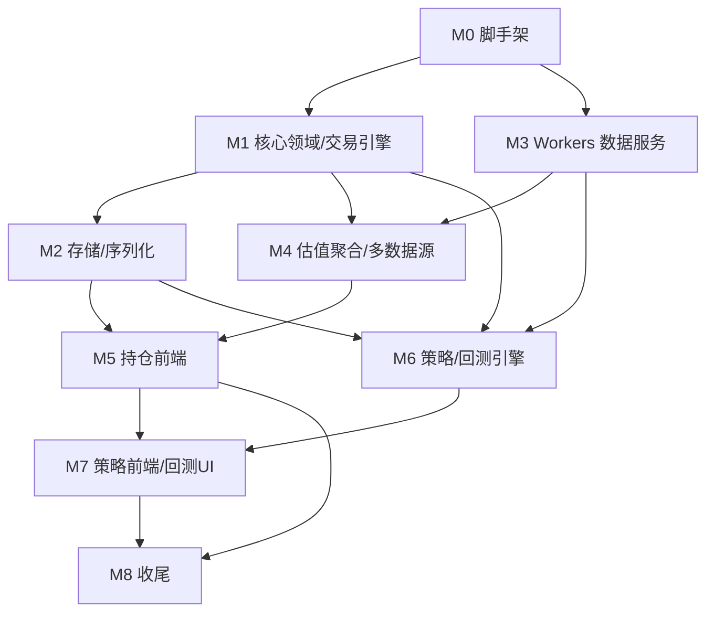

# 基金模拟投资助手 — 任务拆解

> 文档版本：v1.0
> 阶段：任务拆解
> 依赖：《需求分析.md》(R1–R13)、《技术方案.md》
> 说明：任务按依赖顺序编排，分阶段（里程碑）推进；每个任务标注关联需求与所在包。不含工作量估算。

---

## 0. 里程碑总览

| 里程碑 | 名称 | 目标 | 关联需求 |
|--------|------|------|---------|
| M0 | 工程脚手架 | monorepo、构建、部署链路跑通 | R13 |
| M1 | 核心领域与交易引擎 | 模型 + 场外交易规则 + 持仓计算 | R1, R12 |
| M2 | 存储与序列化 | StorageAdapter + Base64 导入导出 | R3, R10, R11 |
| M3 | 数据服务(Workers) | 估值/历史/持仓/行情/日历代理 | R4, R13 |
| M4 | 估值聚合与多数据源 | Provider 抽象 + 三数据源 | R4, R5, R6 |
| M5 | 持仓前端 | 持仓/集合管理/估值 UI | R1, R2, R4, R5 |
| M6 | 策略与回测 | 策略模板 + 策略集 + 回测引擎 | R7, R8, R9 |
| M7 | 策略前端与回测 UI | 策略编辑/回测可视化/导入导出 | R7, R8, R9, R10 |
| M8 | 收尾 | 测试、合规文案、部署、文档 | 全部 |

---

## M0 工程脚手架（R13）✅ 已完成

- [x] **T0.1** 初始化 pnpm monorepo：根 `package.json`、`pnpm-workspace.yaml`、`tsconfig.base.json`、ESLint/Prettier。
- [x] **T0.2** 创建 `packages/core` 包骨架（tsconfig、vitest、`src/index.ts` 导出占位）。
- [x] **T0.3** 创建 `packages/web`：Vite + React + TS + 路由 + Zustand + AntD + ECharts，基础布局与空白页面路由。
- [x] **T0.4** 创建 `packages/workers`：Hono + wrangler 配置，健康检查路由 `/api/ping`，本地 `wrangler dev` 跑通。
- [x] **T0.5** 打通联调：web 配置 Workers API base（Vite 代理），前端调用 `/api/ping` 成功（已浏览器验证连接状态为绿色）。
- [x] **T0.6** 部署链路：Pages 构建配置 + Workers `wrangler deploy` 流程已在 README 文档化。

> 出口标准：三包可独立构建；本地 web ↔ workers 联调成功。✅

---

## M1 核心领域与交易引擎（R1, R12）— `@fund/core` ✅ 已完成

- [x] **T1.1** 定义领域类型：`FundInfo/NavPoint/RedeemFeeTier`、`Portfolio/Position/ShareLot/Order/Transaction`、枚举与 `schemaVersion` 常量。（含 `PendingCash`/`PendingShares` 在途资金与份额）
- [x] **T1.2** 金额/份额精度工具：统一四舍五入（金额 2 位、份额 4 位）+ 安全数值运算 + `generateId`。
- [x] **T1.3** `TradingCalendar`：交易日判定、下一个/上一个交易日、T+N 计算、区间交易日；支持注入节假日/补班，离线退化（周末规则）。
- [x] **T1.4** 确认日计算器：实现 15:00 分界 + 节假日顺延（决策1）。
- [x] **T1.5** 费用计算：申购费(外扣默认/内扣)、赎回费(FIFO 按 `lots` 持有天数分档)、转换费。
- [x] **T1.6** 订单状态机与结算：`下单→PENDING→(净值可得)结算→CONFIRMED`，撤单解冻；份额 T+1 可卖、资金 T+N 到账；幂等结算。
- [x] **T1.7** 交易操作 API：`submitBuy/submitSell/submitConvert/cancelOrder`（生成 Order，遵循确认日与费率，下单即冻结现金/份额）。
- [x] **T1.8** 持仓与收益计算：市值、成本、收益、收益率、当日盈亏、总资产（`snapshotPortfolio`）。
- [x] **T1.9** 单测：47 个用例全绿，覆盖确认日（各时点/节假日）、费率分档、份额计算、买卖转结算、T+1/T+N、持仓收益。**（核心正确性）**

> 出口标准：给定操作序列与净值数据，持仓/现金/流水计算结果正确且有测试覆盖。✅

---

## M2 存储与序列化（R3, R10, R11）— `@fund/core` + `packages/web/adapters` ✅ 已完成

- [x] **T2.1** `StorageAdapter` 接口（core/storage）+ `MemoryStorageAdapter` + 存储键约定 + 三个 Repository（Portfolio/StrategySet/Settings）。
- [x] **T2.2** `LocalStorageAdapter`（web）实现；容量预估（`estimateUsage`/`willExceedLimit`）与超限预警工具。
- [x] **T2.3** 序列化基础：JSON ↔ bytes ↔ Base64（平台无关 btoa/Buffer 双实现）+ pako deflate 压缩；magic header(`FUNDPF1:`/`FUNDSS1:`)。
- [x] **T2.4** `export/importPortfolio`、`export/importStrategySet`：严格 schema 校验、`ImportError` 错误码、重名生成副本、新 id 重分配、`detectImportType`。
- [x] **T2.5** 版本迁移框架：`migratePortfolio/migrateStrategySet` 按 schemaVersion 升级，高版本拒绝。
- [x] **T2.6** 单测：往返幂等、非法数据拒绝（BAD_HEADER/DECODE_FAILED/VALIDATION_FAILED）、重名副本、迁移、仓储 CRUD、容量估算。**（核心正确性，累计 72 用例全绿）**

> 出口标准：持仓集合/策略集可无损 Base64 导出再导入；脏数据被安全拒绝。✅

> 附：M2 同时引入了 `domain/strategy.ts`（策略与策略集类型）与 `strategy/factory.ts`，供序列化与后续 M6 复用。

---

## M3 数据服务 Workers（R4, R13）— `packages/workers` ✅ 已完成

- [x] **T3.1** 路由与中间件骨架：CORS（限定 Pages 域）、错误处理、统一响应/错误码（`ok`/`fail`/`ErrorCodes`）、令牌桶限流、标准化 DTO 定义。
- [x] **T3.2** 缓存层封装：`cached()`（KV + 进程内 Map 双实现）+ 差异化 TTL 预设；带超时的上游 fetch 封装（`UpstreamError`）。
- [x] **T3.3** `/api/calendar`：内置 2023–2026 A股节假日/补班静态数据 + 长缓存 + 周末退化。
- [x] **T3.4** `/api/fund-info`：基金基础信息（搜索接口 + 估值接口退化）。
- [x] **T3.5** `/api/history`：历史净值代理（?code&start&end&source）+ 分页拉取 + 缓存 + 升序标准化。
- [x] **T3.6** providers：天天基金估值适配（JSONP 解析 → 标准 `ValuationDTO`）。
- [x] **T3.7** providers：蛋卷估值适配（derived 接口，最近确认净值，用于对比/容灾）。
- [x] **T3.8** `/api/valuation`：批量（上限 50）+ `source` 切换 + 单基金失败自动降级到备用源。
- [x] **T3.9** providers 解析快照测试（真实样例响应）：eastmoney/danjuan/calendar/限流，共 12 用例全绿。

> 出口标准：估值/历史/日历/基础信息接口返回标准化 DTO，带缓存与降级。✅
> 已用 `wrangler dev` 实测：valuation（天天/蛋卷双源）、history、fund-info、calendar、错误处理均返回正确数据。

> 备注：蛋卷盘中实时估值接口需登录，公开可用的是 derived（最近确认净值）；天天基金提供真正的盘中估值。两源仍可对比。自建估值（真正盘中加权）在 M4 实现。

---

## M4 估值聚合与多数据源（R4, R5, R6）✅ 已完成

### Workers 侧（自建估值）
- [x] **T4.1** `/api/holdings`：天天基金公开持仓抓取（HTML 解析重仓股 + 权重 + 报告期，市场前缀映射 symbol）+ 天级缓存。
- [x] **T4.2** `/api/quote`：腾讯个股实时行情（GBK 解码、批量合并请求规避子请求限制）+ 短缓存。
- [x] **T4.3** `/api/self-nav`：自建估值计算（持仓加权 + 沪深300 补全未覆盖仓位 + confidence 覆盖率，决策5），内部聚合 holdings+quote+baseNav。
- [x] **T4.4** 自建估值算法单测（覆盖率/补全/行情缺失/无基准边界，4 用例）。

### Core 侧（聚合）
- [x] **T4.5** `ValuationProvider` 接口 + `Valuation` 类型 + `VALUATION_SOURCES` 元信息（core 不直接联网）。
- [x] **T4.6** `ValuationAggregator`：注册多源、`fetchFrom` 单源、`fetchCompare` 多源并列对比矩阵（某源失败隔离）。

### Web 侧客户端
- [x] **T4.7** `api/funds.ts` 封装 Workers 各接口；`api/providers.ts` 实现 `ApiValuationProvider` 并构建聚合器。

> 出口标准：同一基金可获取天天/蛋卷/自建三源估值并对比，自建源带覆盖率。✅
> 实测：110011 持仓覆盖率 43.53%，自建估值 +1.07%（confidence 0.4353），GBK 行情解码、沪深300 补全均正确。

> 累计测试：core 77 + workers 25 = 102 用例全绿。

---

## M5 持仓前端（R1, R2, R4, R5）— `packages/web` ✅ 已完成

- [x] **T5.1** `portfolioStore`（Zustand）：集合 CRUD/切换/重命名，桥接 core 交易引擎（买/卖/转/撤/结算）+ adapter 持久化 + 净值缓存驱动结算。
- [x] **T5.2** `valuationStore`：估值拉取、多源选择、手动刷新；`isTradingTime` 交易时段判定。
- [x] **T5.3** `settingsStore` + 设置页：默认数据源、自动刷新开关/间隔、默认申购费率。
- [x] **T5.4** 集合管理页：增删改名、切换、导入/导出（Base64 文本框 + 复制 + 重名副本提示）。
- [x] **T5.5** 持仓总览页：总资产/总收益/收益率/可用现金/当日盈亏 + 持仓明细表（估值/收益）。
- [x] **T5.6** 操作弹窗 `TradeModal`：买入/卖出/转换表单（持仓下拉、校验、提交）。
- [x] **T5.7** 待确认订单卡片（撤单/结算检查）+ 交易流水卡片；进入页面自动触发结算。
- [x] **T5.8** 估值面板：数据源切换、刷新控制、自建源覆盖率标注；`useAutoRefresh` 交易时段轮询。

> 出口标准：用户可创建多集合、完整买卖转换、看实时估值与收益、导入导出集合。✅
> 浏览器实测：创建"测试组合"(¥10万)→ 买入 000001(¥5万)→ 现金冻结为 ¥5万、生成 PENDING 订单且确认日正确顺延至下一交易日(2026-06-01，因 5-31 为周日)→ localStorage 持久化 → Base64 导出(FUNDPF1: 开头)，控制台 0 错误。

---

## M6 策略与回测引擎（R7, R8, R9）— `@fund/core/strategy` ✅ 已完成

- [x] **T6.1** 策略类型与参数（判别联合）：DCA/THRESHOLD_BUY/TAKE_PROFIT/STOP_LOSS/GRID + `StrategySet/ConflictPolicy`（M2 已建类型，M6 补齐运行时类型 `DayContext/StrategyAction`）。
- [x] **T6.2** 策略求值器 `evaluateStrategy`：5 个模板实现 + 运行时状态（定投周期键、阈值买入冷却、网格层）。
- [x] **T6.3** 冲突归并器 `mergeActions`：先卖后买、同向合并（金额相加/比例上限 1）。
- [x] **T6.4** 回测引擎 `runBacktest`：逐交易日循环（求值→归并→成交→快照），统一申购/赎回费率。
- [x] **T6.5** 回测指标：总收益、年化、最大回撤、买入持有基准对比。
- [x] **T6.6** 单测：5 模板触发、冲突归并、指标计算、回测端到端（定投/止盈/费率/回撤/边界），共 31 用例。**（核心正确性）**

> 出口标准：给定策略集 + 历史净值 + 区间，输出可验证的回测指标与流水。✅
> 累计测试：core 111 + workers 25 = 136 用例全绿。

---

## M7 策略前端与回测 UI（R7, R8, R9, R10）— `packages/web` ✅ 已完成

- [x] **T7.1** `strategyStore`：策略/策略集 CRUD + adapter 持久化。
- [x] **T7.2** `StrategyModal` 策略编辑：模板选择 + 按模板动态参数表单（5 类模板，百分比字段自动换算）。
- [x] **T7.3** 策略集页：组合策略、启用开关、导入/导出（Base64 FUNDSS1，复用 M2）。
- [x] **T7.4** 回测页表单：选策略集/区间/初始资金/基准标的。
- [x] **T7.5** 回测执行：独立 Web Worker 跑 core `runBacktest`；历史数据经 api 拉取。
- [x] **T7.6** 回测结果可视化（ECharts）：净值曲线 vs 基准、指标卡片、操作流水表、超额收益提示。

> 出口标准：用户可定义策略集、导入导出、选区间回测并看到可视化结果。✅
> 浏览器实测：创建策略集"定投回测"→ 加 DCA 策略（000001 每月¥2000）→ 回测 2024 全年 → 12 笔定投、期末 ¥101,232.94(+1.23%)、最大回撤 2.17%、基准对比 -3.24%(超额+4.5%)，净值曲线/流水正常。

> **集成期修复**：发现并修复天天基金历史净值接口实际每页上限 20 条（忽略更大 pageSize）的问题——改用 TotalCount 驱动分页，使全区间历史数据完整返回（2024 全年 243 个交易日）。此前回测仅 1 笔交易是该 API 缺陷所致，回测引擎本身正确。

---

## M8 收尾（全部）✅ 已完成

- [x] **T8.1** 合规文案：全局横幅 + 回测结果页风险提示（历史不代表未来、统一费率近似、不构成投资建议）。
- [x] **T8.2** 错误与降级体验：估值失败 Alert 提示（可切源重试）、数据源失败自动降级（M3）、空状态/加载态。
- [x] **T8.3** 核心库测试补全：新增 portfolio/strategy 工厂测试，累计 core 117 用例。
- [x] **T8.4** Workers 限流/缓存：令牌桶限流（M3）+ 差异化 TTL；修复历史接口分页缺陷（M7）。
- [x] **T8.5** 部署：Pages 构建/输出/环境变量、Workers CORS 白名单与 KV 绑定说明已文档化；前端按 react/antd 分包 + ECharts 懒加载，初始包显著减小。
- [x] **T8.6** 文档：README 补充部署步骤、数据来源说明、测试命令。
- [x] **T8.7** 小程序演进预留：README 说明 `WxStorageAdapter`、网络复用、UI 重写、回测主线程方案。

> 出口标准：全部测试通过、构建无警告、部署与演进路径清晰。✅
> 最终：core 117 + workers 25 = 142 用例全绿；core/web/workers 全部构建通过。

---

## 任务依赖图

**并行建议**：M0 完成后，M1（core）与 M3（workers）可并行；M2 依赖 M1；M4 依赖 M1+M3。

---

## 需求 → 任务覆盖矩阵

| 需求 | 描述 | 覆盖任务 |
|------|------|---------|
| R1 | 模拟持仓操作 | T1.1–T1.9, T5.5–T5.7 |
| R2 | 多持仓集合 | T2.1, T5.1, T5.4 |
| R3 | 持仓 Base64 导入导出 | T2.3–T2.6, T5.4 |
| R4 | 实时估值查看 | T3.5–T3.8, T4.5–T4.7, T5.2, T5.8 |
| R5 | 多数据源切换对比 | T3.6–T3.8, T4.6, T5.8 |
| R6 | 自建公开持仓估算 | T4.1–T4.4 |
| R7 | 自定义策略 | T6.1–T6.2, T7.1–T7.2 |
| R8 | 策略集 | T6.1, T6.3, T7.3 |
| R9 | 策略回测 | T6.4–T6.6, T7.4–T7.6 |
| R10 | 策略集 Base64 导入导出 | T2.3–T2.6, T7.3 |
| R11 | localStorage 持久化/抽象 | T2.1–T2.2 |
| R12 | 平台无关核心库 | M1/M2/M4(core)/M6 全部, T8.7 |
| R13 | Workers 数据/计算 | M0, M3, M4(workers), T8.4–T8.5 |

---

## 交付后调整记录（Post-Delivery）

> 交付后基于用户反馈的迭代，记录变更点、影响范围与验证方式，保持文档与实现同步。

### ADJ-1 新建集合支持配置现有持仓（R1/R2 增强）
- **背景**：用户希望新建持仓集合时可直接录入已有的基金持仓，而非只能从空仓开始买入。
- **变更**：
  - `@fund/core` `createPortfolio` 新增可选 `positions: InitialPosition[]` 参数（基金代码 / 持有份额 / 持仓成本 / 可选买入日期）；自动生成份额批次 lot（`nav = cost / shares`）并设为可卖。
  - 收益口径：`initialCash`（收益基准）= 输入可用现金 + 现有持仓成本之和，保证"总收益 = 总资产 − 初始总投入"。
  - Web `portfolioStore.create` 透传 positions 并异步预取基金名称；`PortfoliosPage` 新建弹窗加入"现有持仓（可选）"动态表单（Form.List，可增删多条）。
- **测试**：新增 core 工厂用例（成本计入基准、份额可卖、忽略 0 份额项）；浏览器实测 100,000 现金 + 000001(5000份/成本6500) → 基准 106,500、avg nav 1.30 正确。

### ADJ-2 编辑策略未回填自身数据（bug 修复）
- **现象**：策略集中点击"编辑"，弹窗未回填该条策略的已有参数（尤其模板相关的条件字段）。
- **根因**：原 `StrategyModal` 用 `useEffect + setFieldsValue` 配合 `destroyOnHidden`，条件参数字段挂载时机晚于赋值，导致回填丢失。
- **修复**：改为表单级 `initialValues` + `key` 强制重建表单；切换模板类型用 `onValuesChange` 填默认参数；移除与表单级初值冲突的字段级 `initialValue`。
- **测试**：浏览器实测编辑"月定投"→ 名称/标的/类型/周期/执行日/金额全部正确回填。

> 累计测试：core 119 + workers 25 = 144 用例全绿；web typecheck + build 通过。

### ADJ-3 持仓成本单价精度 + 初始持仓收益口径修复
- **背景/问题**：
  1. 新建集合录入现有持仓时，成本以"总金额"输入、单价由 `cost/shares` 推导且未规整，精度不可控。
  2. 存在初始持仓时，估值加载前总收益/收益率异常（持仓被错算为 −100% 亏损）。
- **变更**：
  - `InitialPosition` 字段由 `cost`（总成本）改为 `costPrice`（成本单价，精确到 4 位小数）；总成本由 `shares × costPrice` 推导。新增 `roundNav`（4 位）工具。
  - `snapshotPortfolio`：某持仓缺价（估值未加载/数据源失败）时回退使用其平均成本作为净值（盈亏 0），不再错算成市值 0 导致的巨额假亏损。
  - Web：新建弹窗持仓项改为"成本单价"输入（`precision=4`）；`HomePage` priceMap 跳过无效估值（nav≤0），交由 core 按成本回退。
- **测试**：core 新增 `valuation-calc.test.ts`（缺价回退、混合持仓、正常盈亏）+ 工厂单价精度用例，共 123 用例全绿；浏览器实测：成本单价 1.3001 精确存储、初始总收益显示 ¥0.00 / +0.00%（修复前为 −6500.50 / −100%）。

### ADJ-4 持仓展示按"交易时段"区分估值/实际净值
- **需求**：持仓明细的涨跌与当日盈亏，仅在交易日的交易时间窗口（9:30-15:00 连续，含午间休市 11:30-13:00）内展示盘中估值；其余时间（非交易日、节假日、收盘后）一律展示已公布的实际净值与实际当日涨跌。该规则对所有数据源生效。
- **变更**：
  - `valuationStore` 重构：对外暴露统一的 `DisplayQuote`（nav / growthPct / prevNav / isEstimate / source / confidence）与 `estimating` 标志。
  - 新增 `isEstimating()`：结合交易日历（排除节假日，复用 `getTradingCalendar`）+ 时间窗口判断是否处于"估值变动中"。
  - `refresh` 分支：估值中 → 取所选数据源估值；否则 → 经 `/api/history` 取最近净值点，用实际净值与实际当日涨跌（自建源无历史，回退 eastmoney；蛋卷用蛋卷历史）。
  - `HomePage`：列标题随状态切换"估值/估算涨跌" ↔ "净值/当日涨跌"，新增"盘中估值/已公布净值"状态标签；自建覆盖率仅在估值时展示；priceMap 使用 DisplayQuote。
- **测试**：浏览器实测（当前为周日非交易日）→ 标签"已公布净值"、列"净值/当日涨跌"、使用真实净值 1.3080(-3.54%)、当日盈亏按真实相邻净值计算；`isEstimating` 边界验证：周五10:00=true、周五16:00=false、周日=false、国庆节=false。
- **修订（午间休市）**：估值时段由"9:30-11:30 / 13:00-15:00 两段"调整为"9:30-15:00 连续"，午间休市（11:30-13:00）仍展示上午估值（此时净值未公布，最新数据即上午估值）。边界复测：周五 12:00 / 12:59 = true，09:29 = false，15:01 = false，周日/国庆 12:00 = false。
- **修订（集合竞价 + 盘后）**：估值展示窗口进一步扩展为"交易日 ≥9:15 至当日净值公布前"：
  - 开盘前集合竞价（9:15-9:30）展示估值；
  - 收盘后（>15:00）持续展示估值，逐基金经 `/api/history` 判断当日净值是否已公布（最新净值日期 === 今日 → 切实际净值），未公布则继续展示估值。
  - 边界复测：周五 09:14 = false、09:15/09:20 = true、16:00/23:00 = true（净值未公布时）、周日/国庆 = false。`estimating` 全局标志改为"当前展示项中是否仍有估值"。

### ADJ-5 回测指标丰富化 + 最大回撤口径修复
- **背景/问题**：
  1. 回测指标过少，需给出更详尽数据（投入本金、期末总收益、期末持有资产等）。
  2. 最大回撤计算有误——基于"总资产"（含大量闲置现金）计算，定投场景下基金真实回撤被稀释成很小的正数（161725 实测结果明显偏小、不正确）。
- **变更**：
  - `BacktestMetrics` 扩展为详尽指标：期初资金 / 累计买入 / 卖出回收 / 费用 / 净投入 / 期末总资产 / 现金 / 持有资产 / 持仓成本 / 总收益 / 总收益率 / 年化 / 持仓浮盈 / 持有收益率 / 总资产最大回撤 / 持有最大回撤 / 买卖次数 / 交易日数。
  - `DailySnapshot` 增加 `cost` / `investedCapital` / `holdingIndex`（时间加权持有指数）。
  - 新增 `holdingMaxDrawdown` 与通用 `drawdownOf`：基于时间加权持有指数（日因子 = 市值 /（上一日市值 + 当日净流入）），剔除现金稀释与定投资金流入，反映持仓真实回撤。
  - 前端：回测指标卡片按"资金/期末状态/收益/风险与交易"分组展示全部指标；净值曲线新增"持仓市值""累计净投入""持仓成本"曲线。
- **测试**：core 新增 metrics/backtest 用例（drawdownOf、holdingMaxDrawdown 不被现金稀释、丰富指标字段），共 129 用例全绿；浏览器实测真实 161725（2021）：总资产回撤 4.82%、**持有回撤 31.37%**（吻合净值 1.6466→1.1255 的真实跌幅），期末持有资产 22,684.73、持有收益率 −16.9% 等全部正确。

### ADJ-6 回测指标完整化（风险调整比率等）
- **需求**：指标尽可能完整。
- **变更**：在 ADJ-5 基础上补充：
  - 风险调整收益：夏普比率、索提诺比率、卡玛比率（基于时间加权持有口径，支持 `riskFreeRate` 入参）。
  - 风险：年化波动率、盈利日占比、持有最大回撤的峰值/谷底日期。
  - 收益：持有年化收益率。
  - 基准：买入持有的年化收益与最大回撤（原仅总收益）。
  - metrics 工具新增 `dailyReturns / stdDev / annualizedVolatility / sharpeRatio / sortinoRatio / calmarRatio / winningDaysRatio / drawdownDetail`。
  - 前端回测指标卡片按"资金 / 期末状态 / 收益 / 风险 / 风险调整收益 / 交易"分组展示全部指标，含 Tooltip 说明；基准 Alert 增加年化与最大回撤。
- **测试**：core 新增风险指标用例（共 137 用例全绿）；浏览器实测 161725(2021)：持有回撤 31.37%（峰值 2021-02-10→谷底 2021-08-20）、年化波动率 38.9%、夏普 −0.49、索提诺 −0.65、卡玛 −0.54、盈利日占比 53.3%、基准年化 −12.5%/回撤 30.5%，数据自洽且符合金融直觉。

### ADJ-7 多策略集横向对比
- **需求**：在多个策略集之间做横向对比。
- **变更**：
  - 回测页改为 Tabs：「单策略集回测」（原功能，抽为 `SingleBacktest`）+「多策略集对比」（`ComparisonPanel`）。
  - 对比面板：多选 2+ 策略集，相同区间/初始资金/费率/基准各自独立回测；共享一次历史净值拉取避免重复请求。
  - 指标对比表（13 项指标 × 各策略集），按越大/越小越优用 ★ 高亮每行最优；收益类指标红绿着色。
  - 总资产曲线对比图（`ComparisonChart`）：每集合一条曲线 + 基准；日期轴取最长序列、缺失日按上一有效值延展。
- **测试**：web typecheck + build 通过；浏览器实测两策略集（白酒定投 161725 vs 华夏成长定投 000001，2021）：分别得出总收益 −1.32%/−2.59%、持有回撤 31.37%/25.07%、夏普 −0.44/−0.73，结果各异且自洽；Tabs、对比表单与说明渲染正常。

### ADJ-8 新增策略误回填修复 + 新增「阈值卖出」策略类型
- **问题1（bug）**：点击「新增策略」时会回填上一次编辑过的策略参数。根因：`StrategyModal` 的 Form 实例在多次打开间被复用，`initialValues` 仅在挂载时生效，快速关闭→打开未真正卸载表单。
  - **修复**：拆分为外层 Modal（仅管开关）+ 内层 `StrategyForm`（打开时才挂载），并用"每次打开递增的 openSeq + editing.id"作为 key 强制重建，保证每次打开都是全新 Form 实例。编辑时仅回填当前策略参数。
- **问题2（需求）**：新增「阈值卖出（涨幅触发）」策略，与「阈值买入」对应。
  - 新增 `StrategyTemplate='THRESHOLD_SELL'` 与 `ThresholdSellParams{ risePct, window, sellRatio }`；
  - 新增 `evalThresholdSell` 求值器（近 window 日涨幅达 risePct 且有持仓时按 sellRatio 卖出，含 `lastSellDayIndex` 冷却）；
  - 序列化白名单、前端模板选项/参数表单/默认值/描述均补齐。
- **测试**：core 新增 THRESHOLD_SELL 求值用例（共 141 用例全绿）；浏览器实测：编辑网格策略后「新增策略」显示干净的 DCA 默认值（修复前残留网格值）、编辑各策略仅回填自身参数、阈值卖出类型可选并正确渲染参数表单。

### ADJ-9 新增「智能定投」两种策略类型
- **需求**：新增 智能定投-涨跌幅模式 与 智能定投-均线模式。
- **设计**：均为定投变体，按周期触发，但投入金额随"偏离度"动态调整——
  - 涨跌幅模式：偏离度 = 近 referenceWindow 日涨跌幅；
  - 均线模式：偏离度 = 当前净值相对 maWindow 日均线的偏离；
  - 投入倍数 factor = clamp(1 − (deviation/stepPct)×adjustPct, minFactor, maxFactor)，下跌/低于均线多投、上涨/高于均线少投；金额 = baseAmount × factor（factor→0 跳过）。
- **变更**：
  - 新增 `SMART_DCA_CHANGE` / `SMART_DCA_MA` 模板与参数类型；
  - 抽出 `periodDue` 复用定投周期判定；新增 `evalSmartDcaChange` / `evalSmartDcaMa` 与 `smartFactor`；
  - 序列化白名单、前端模板选项/动态参数表单（基准金额、参考窗口/均线窗口、每档幅度、调整比例、倍数上下限）/默认值/列表描述均补齐。
- **测试**：core 新增智能定投求值用例（共 149 用例全绿）；浏览器实测真实 161725（2021）对比：普通定投每月固定¥2000、持有 −14.09%；涨跌幅模式按跌幅在 ¥499~¥3493 间动态调整、持有 −13.4%；均线模式 ¥55~¥3443、持有 −13.1%——智能定投均跑赢普通定投，逻辑正确。

### ADJ-10 新增「目标市值法定投（Value Averaging）」策略
- **背景**：在已有定投族基础上补充学术上表现最优的经典定投变体。
- **设计**：设定持仓市值按固定额度匀速增长的目标路径——第 k 期目标市值 = `targetStep × k`。每期买入/卖出恰好使当前持仓市值贴近目标：
  - 市值低于目标（下跌）→ 买入差额，自动越跌越买（受 `maxBuy` 单期上限保护）；
  - 市值高于目标（上涨）→ 卖出超出部分（`allowSell=true`，标准做法）或只买不卖（`allowSell=false`）。
- **变更**：
  - 新增 `VALUE_AVERAGING` 模板与 `ValueAveragingParams{ period, dayOfPeriod, targetStep, allowSell, maxBuy }`；运行时 `vaPeriodCount` 记录期数；
  - 新增 `evalValueAveraging`（复用 `periodDue`，按目标-市值差额产出 BUY 金额或 SELL 份额）；
  - 序列化白名单、前端模板选项（标注"推荐"）/参数表单（含 allowSell 开关）/默认值/列表描述均补齐。
- **测试**：core 新增 6 个目标市值法用例（共 155 用例全绿）；浏览器实测真实 161725（2021–2023，初始 20 万、每期目标 +2000）：普通定投持有 −38.67%（36买/0卖）；目标市值法带卖出 −38.32%（31买/5卖，高位自动减仓5次）；只买不卖 −38.02%（最优）——均跑赢普通定投，且正确实现"低买高卖贴目标"。

### ADJ-11 卖出端智能调整：新增「智能止盈（分档加码卖出）」
- **需求**：给策略的卖出端也支持智能调整（对应买入端的智能定投）。
- **设计**：收益越高卖得越多，逐步降低仓位锁定利润——
  - 收益率达 `startGainPct` 起开始止盈；当前档位 tier = floor((收益率 − startGainPct)/stepPct)+1；
  - 相对上次已触发的最高档每上一档，按 `stepSellRatio` 累加卖出比例（上限 `maxSellRatio`），基于当前剩余份额卖出；
  - 同档不重复触发、收益回落不卖（用 `lastProfitTier` 去重）。
- **变更**：
  - 新增 `SMART_TAKE_PROFIT` 模板与 `SmartTakeProfitParams{ startGainPct, stepPct, stepSellRatio, maxSellRatio }`；运行时 `lastProfitTier` 记录已触发最高档；
  - 新增 `evalSmartTakeProfit`；序列化白名单、前端模板选项/参数表单/默认值/列表描述均补齐。
- **测试**：core 新增 6 个智能止盈用例（共 161 用例全绿）；浏览器实测：合成上涨净值下 +30.3%卖第1档25%、+60.3%卖第2档25%（基于剩余份额，逐步减仓），同档不重复、回落不卖；真实 161725 牛市段定投+智能止盈组合正确触发。
- **策略库现状**：共 10 种——定投 / 智能定投(涨跌幅·均线) / 目标市值法 / 阈值买入 / 阈值卖出 / 止盈 / 智能止盈 / 止损 / 网格；买入端与卖出端均具备智能调整能力。
